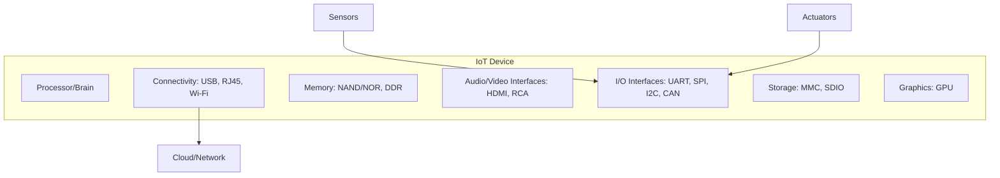

# Module 1: Introduction to Internet of Things (IoT)

## 1. Introduction to IoT

### 1.1 Definition
The **Internet of Things (IoT)** refers to a network of interconnected physical objects (devices, machines, vehicles, or even people) embedded with sensors, software, and unique identifiers (UIDs). These "things" can collect, exchange, and process data over a network without requiring direct human-to-human or human-to-computer interaction.

### 1.2 Characteristics of IoT
1.  **Always Connected:** IoT devices are designed to stay connected, though they may enter "sleep mode" to conserve energy.
2.  **Good at Teamwork:** They can communicate with a diverse range of devices regardless of hardware or software differences.
3.  **Adaptive:** IoT systems can adjust their behavior based on environmental changes (e.g., a smart light dimming when sunlight increases).
4.  **Quietly Smart:** They don't just collect data; they process it to provide meaningful insights (e.g., fitness trackers analyzing activity levels).
5.  **Scalable:** IoT architectures are designed to handle anywhere from a few devices to thousands without losing efficiency.
6.  **Energy Conscious:** Devices prioritize low power consumption to ensure long-term operation.

### 1.3 History & Evolution
*   **1982:** Vending Machine (First IoT concept) reported inventory status remotely.
*   **1990:** Toaster (First internet-connected appliance) allowed remote control.
*   **1999:** The term "Internet of Things" was coined by **Kevin Ashton**.
*   **2000:** LG introduced the Smart Fridge.
*   **2007:** iPhone released, becoming a hub for IoT via apps.
### 1.4 Advantages & Disadvantages of IoT
| Advantages | Disadvantages |
| :--- | :--- |
| **Improved Efficiency:** Automation reduces human effort and time. | **Security Risks:** More devices mean more entry points for hackers. |
| **Cost Savings:** Optimization of resources and energy. | **Privacy Concerns:** Constant data collection can lead to misuse. |
| **Better Decision Making:** Real-time data provides better insights. | **Complexity:** Designing and maintaining massive networks is hard. |
| **Convenience:** Remote control of home and office environments. | **Job Loss:** Automation may replace certain manual labor roles. |

---

## 2. IoT Design & Architecture

### 2.1 Physical Design of IoT
Physical design refers to the actual hardware components and protocols that build the system.

#### A. IoT "Things" / Nodes
"Things" are the smart devices that perform sensing, actuation, and monitoring.
*   **Examples:** Smart TVs, wearables (smartwatches), autonomous cars, smart payment terminals.

#### B. Generic Block Diagram of an IoT Device

### 2.2 Logical Design of IoT
Logical design refers to the abstract representation of entities and processes without delving into low-level implementation details.

#### IoT Functional Blocks
1.  **Device Layer (Sensing/Actuation):** Gathers data and performs physical actions.
2.  **Connectivity/Gateway Layer:** Connects devices to the network (Gateways, Routers).
3.  **Data Processing Layer:** Stores and analyzes data (Cloud/Edge platforms).
4.  **Application Layer:** Provides user interfaces (apps, dashboards).
5.  **Security & Management:** Handles authentication, updates, and system health.

---

## 3. IoT Communication Models

IoT devices use different communication patterns depending on the use case:

### 3.1 Request-Response Model
A stateless model where the client sends a request and the server responds.
*   **Example:** A browser (client) requesting a webpage from a server.

### 3.2 Publish-Subscribe Model
Involves **Publishers** (data source), **Brokers** (managers), and **Consumers** (subscribers). Publishers send data to "topics" in the broker, and the broker distributes it to all subscribers of that topic.
*   **Key:** Publishers and Consumers are decoupled (they don't need to know each other).

### 3.3 Push-Pull Model
Data producers push data into queues, and consumers pull data from those queues. Queues act as buffers to handle rate mismatches.

### 3.4 Exclusive Pair Model
A bidirectional, full-duplex, stateful model with a persistent connection.
*   **Example:** WebSockets.

---

## 4. IoT Communication APIs

### 4.1 REST-based APIs (Representational State Transfer)
*   **Architecture:** Client-Server.
*   **Principles:**
    *   **Stateless:** Each request contains all info needed.
    *   **Cacheable:** Responses can be cached to improve efficiency.
    *   **Layered System:** Clients can't tell if they are connected directly to the server or an intermediary.
    *   **Uniform Interface:** Standardized methods like GET, POST, PUT, DELETE.

### 4.2 WebSocket-based APIs
*   Provides full-duplex communication over a single socket connection.
*   **Handshake:** Starts over HTTP and "upgrades" to WebSocket.
*   **Advantage:** Lower latency and overhead compared to REST for real-time data.

---

## 5. IoT Enablers & Networking

### 5.1 Sensors & Actuators
*   **Sensors:** Convert physical signals into digital data (e.g., Temperature, Gyro, IR, Ultrasonic).
*   **Actuators:** Perform actions based on triggers (e.g., Motors, Switches, Relays).

### 5.2 Protocol Stack
| Layer | Protocols |
| :--- | :--- |
| **Application** | HTTP, CoAP, MQTT, XMPP, AMQP |
| **Transport** | TCP, UDP |
| **Network** | IPv4, IPv6, 6LoWPAN |
| **Link** | Ethernet (802.3), Wi-Fi (802.11), Bluetooth (802.15.4), Cellular, **Zigbee (802.15.4)** |

### 5.3 Special Protocols & Concepts
*   **Zigbee:** Based on IEEE 802.15.4, it is a low-power, low-data rate wireless mesh network standard. It is widely used in home automation and industrial control due to its ability to support thousands of devices in a mesh.
*   **HART (Highway Addressable Remote Transducer):** A hybrid analog+digital industrial automation protocol. It can communicate over legacy 4-20mA analog wiring, making it crucial for Industrial IoT (IIoT) where existing infrastructure is used.
*   **Participatory Sensing:** A concept where individuals and communities use their personal mobile devices (like smartphones) to collect and share data from their environment (e.g., traffic noise, air quality).

---

## 6. M2M vs IoT: The Comparison

| Basis | M2M (Machine-to-Machine) | IoT (Internet of Things) |
| :--- | :--- | :--- |
| **Scope** | Limited/Point-to-point | Large scale/Cloud-based |
| **Internet** | Not always required | Mandatory |
| **Communication** | Mostly hardware-based | Hardware + Software based |
| **Data Sharing** | Limited to parties involved | Shared across applications |
| **Protocols** | Traditional (e.g., Cellular) | Internet Protocols (HTTP, MQTT) |

---

## 7. Solved Questions (From Previous Papers)

### Q1. Differentiate between M2M and IoT. (2023 & 2025)
**Answer:** Refer to the comparison table in Section 6. Key differences include M2M being point-to-point and hardware-centric, while IoT is cloud-centric and involves complex software integration.

### Q2. Define the role of sensors in IoT. (2025)
**Answer:** Sensors are the "eyes and ears" of IoT. They collect physical parameters from the environment (temperature, light, motion) and convert them into digital signals that can be processed by a computer.

### Q3. What are the five principles of REST API? (2023)
**Answer:** 
1. Client-Server separation.
2. Statelessness.
3. Cacheability.
4. Layered System.
5. Uniform Interface.

### Q4. Compare MQTT and AMQP protocols. (2025)
**Answer:** 
*   **MQTT:** Lightweight, publish-subscribe model, ideal for low-bandwidth/constrained devices.
*   **AMQP:** More robust, supports both point-to-point and pub-sub, high performance and secure, but heavier than MQTT.

### Q5. Explain the architecture of Wireless Sensor Networks (WSN). (2025)
**Answer:** WSN consists of spatially distributed autonomous sensors to monitor physical or environmental conditions. Architecture involves Sensor Nodes, a Gateway (Sink Node), and a Network/Cloud for data analysis.

### Q6. Describe the HART protocol and its relevance in IIoT. (2025)
**Answer:** HART (Highway Addressable Remote Transducer) is a hybrid protocol that allows digital communication over the same 4-20mA analog wires used by traditional industrial instruments. Its relevance in IIoT is huge because it allows companies to upgrade to "smart" monitoring without replacing thousands of miles of existing legacy cabling.

### Q7. What is the role of a gateway in wireless IoT networks? (2025)
**Answer:** A gateway acts as a bridge between local IoT devices (which might use low-power protocols like Zigbee or Bluetooth) and the broader internet (using TCP/IP). It performs data aggregation, protocol translation, and often provides security features like firewalls.

### Q8. Define Industrial IoT (IIoT). (2025)
**Answer:** IIoT refers to the extension and use of the Internet of Things (IoT) in industrial sectors and applications. It focuses on machine-to-machine (M2M) communication, big data, and machine learning to enable industries to have better efficiency and reliability in their operations.

### Q9. List common attacks on IoT systems and possible defense mechanisms. (2025)
**Answer:** 
*   **Attacks:** Denial of Service (DoS), Eavesdropping, Man-in-the-Middle (MitM), Physical tampering, and Brute-force attacks on weak passwords.
*   **Defenses:** End-to-end encryption, strong authentication (MFA), regular firmware updates, using secure protocols (HTTPS/TLS), and network segmentation.

---

## 8. Self-Generated Practice Questions

### Q1. Scenario: You are designing a real-time health monitoring system that needs to push alerts to multiple doctors simultaneously. Which communication model would you choose and why?
**Answer:** The **Publish-Subscribe Model** is best. The health device acts as a publisher, sending "Alert" messages to a specific topic. All doctors (subscribers) subscribed to that patient's topic will receive the alert instantly. This allows for easy scaling as more doctors can be added without changing the device's logic.

### Q2. Why is IPv6 considered crucial for IoT scalability?
**Answer:** IoT involves billions of devices. IPv4 (32-bit) only supports about 4.3 billion addresses, which is insufficient. IPv6 (128-bit) provides a virtually limitless address space, ensuring every "thing" can have a unique IP.

### Q3. Describe a situation where WebSockets are superior to REST APIs in IoT.
**Answer:** In a **Smart Grid monitoring system** where high-frequency data (voltage/current readings) needs to be visualized in real-time. The persistent connection of WebSockets avoids the overhead of repeated HTTP handshakes required by REST, leading to much lower latency.
