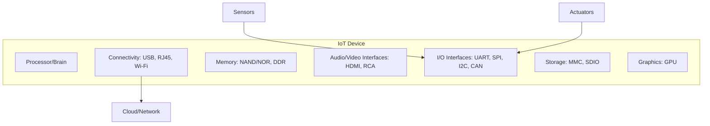

# Module 1: Introduction to Internet of Things (IoT)

## 1. Introduction to IoT

### 1.1 Definition
The **Internet of Things (IoT)** refers to a network of interconnected physical objects (devices, machines, vehicles, or even people) embedded with sensors, software, and unique identifiers (UIDs). These "things" can collect, exchange, and process data over a network without requiring direct human-to-human or human-to-computer interaction.

#### Exam (6M) Notes: Define IoT + explain components
**Definition (2-3 lines):** IoT = uniquely identifiable physical objects ("things") + sensors/actuators + connectivity + compute, enabling monitoring, control, and automation over networks.

**Core components (write as short notes):**
1. **Things/Devices:** Embedded systems that sense/actuate (e.g., smart meter, wearable).
2. **Sensors:** Convert physical parameters into electrical/digital signals (temperature, humidity, motion).
3. **Actuators:** Convert digital control signals into physical action (relay, motor, valve).
4. **Connectivity:** Wired/wireless links to send data (Wi-Fi, BLE, Zigbee, cellular, Ethernet).
5. **Gateway/Edge (optional but common):** Aggregates devices, translates protocols, filters data, enforces security.
6. **Cloud/IoT Platform:** Storage + analytics + device management + rule engine.
7. **Applications/UI:** Dashboards/mobile apps, alerts, reporting, automation workflows.
8. **Security/Management:** Authentication, authorization, encryption, OTA updates, monitoring.

**Typical IoT data flow (1 line diagram):**
Sensing -> Local processing -> Connectivity -> Gateway/Internet -> Cloud storage/analytics -> Decision/rules -> Actuation/notification.

### 1.2 Characteristics of IoT
1.  **Always Connected:** IoT devices are designed to stay connected, though they may enter "sleep mode" to conserve energy.
2.  **Good at Teamwork:** They can communicate with a diverse range of devices regardless of hardware or software differences.
3.  **Adaptive:** IoT systems can adjust their behavior based on environmental changes (e.g., a smart light dimming when sunlight increases).
4.  **Quietly Smart:** They don't just collect data; they process it to provide meaningful insights (e.g., fitness trackers analyzing activity levels).
5.  **Scalable:** IoT architectures are designed to handle anywhere from a few devices to thousands without losing efficiency.
6.  **Energy Conscious:** Devices prioritize low power consumption to ensure long-term operation.

#### Exam (6M) Notes: Characteristics / features of IoT
Add these high-yield points (short explanation each):
1. **Unique Identification:** Each thing is uniquely addressable (UID/MAC/IP/IPv6), enabling tracking and control.
2. **Heterogeneity & Interoperability:** Devices differ in hardware/OS/protocols, so gateways/standards enable them to work together.
3. **Sensing + Actuation:** IoT is not only monitoring; it also performs actions (closing a valve, switching a relay).
4. **Context Awareness:** IoT systems use context (location, time, environment) to make decisions (smart AC based on occupancy).
5. **Real-time/Low-latency Requirements:** Many IoT apps need fast response (industrial safety, healthcare alerts).
6. **Reliability & Fault Tolerance:** Must handle intermittent networks, device failures, retries, buffering.
7. **Security & Privacy Sensitivity:** Continuous data collection makes confidentiality/integrity/availability critical.

### 1.3 History & Evolution
*   **1982:** Vending Machine (First IoT concept) reported inventory status remotely.
*   **1990:** Toaster (First internet-connected appliance) allowed remote control.
*   **1999:** The term "Internet of Things" was coined by **Kevin Ashton**.
*   **2000:** LG introduced the Smart Fridge.
*   **2007:** iPhone released, becoming a hub for IoT via apps.

#### Exam (6M) Notes: Evolution of IoT (milestones + enabling tech)
1. **RFID & Auto-ID (1990s):** RFID tags and Auto-ID labs pushed the idea of uniquely identifying objects.
2. **Wireless + Embedded Systems:** Cheap sensors/MCUs and radios enabled instrumenting everyday objects.
3. **Internet & IP for constrained devices:** Growth of IPv6 and lightweight stacks enabled billions of devices.
4. **Smartphones:** Became IoT controllers and data gateways (apps + BLE/Wi-Fi).
5. **Cloud computing:** Enabled large-scale storage, analytics, and remote device management.
6. **Edge/Fog computing:** Processing near devices to reduce latency and bandwidth usage.
### 1.4 Advantages & Disadvantages of IoT
| Advantages | Disadvantages |
| :--- | :--- |
| **Improved Efficiency:** Automation reduces human effort and time. | **Security Risks:** More devices mean more entry points for hackers. |
| **Cost Savings:** Optimization of resources and energy. | **Privacy Concerns:** Constant data collection can lead to misuse. |
| **Better Decision Making:** Real-time data provides better insights. | **Complexity:** Designing and maintaining massive networks is hard. |
| **Convenience:** Remote control of home and office environments. | **Job Loss:** Automation may replace certain manual labor roles. |

#### Exam (6M) Notes: Advantages + limitations/challenges of IoT
**Advantages (explain any 4-5):**
1. **Automation & control:** Remote and automatic control reduces manual intervention.
2. **Real-time monitoring:** Immediate visibility into system health (machines, crops, patients).
3. **Predictive maintenance:** Data trends predict failure, reducing downtime.
4. **Resource optimization:** Better energy/water usage (smart grids, smart irrigation).
5. **New services/business models:** Usage-based insurance, pay-per-use devices, etc.

**Limitations/Challenges (explain any 4-5):**
1. **Security threats:** Weak passwords, insecure firmware, botnets, MITM attacks.
2. **Privacy risks:** Location/health data can be sensitive; misuse can harm users.
3. **Interoperability issues:** Many vendors/standards lead to integration problems.
4. **Power constraints:** Battery-powered devices require low energy design.
5. **Reliability & network issues:** Packet loss, disconnections, congestion.
6. **Data management:** Large volumes of streaming data require storage and analytics.

---

## 2. IoT Design & Architecture

### 2.1 Physical Design of IoT
Physical design refers to the actual hardware components and protocols that build the system.

#### A. IoT "Things" / Nodes
"Things" are the smart devices that perform sensing, actuation, and monitoring.
*   **Examples:** Smart TVs, wearables (smartwatches), autonomous cars, smart payment terminals.

#### Exam (6M) Notes: Physical design of IoT / IoT node components
In exams, define a node and explain the blocks clearly:
1. **Sensing unit:** Sensors + signal conditioning + ADC (if analog) to digitize readings.
2. **Processing unit:** MCU/SoC (e.g., ARM Cortex) running firmware/RTOS; handles sampling, control logic, encryption.
3. **Communication unit:** Radio module (Wi-Fi/BLE/Zigbee/LoRa/cellular) + antenna; provides connectivity.
4. **Actuation unit (if required):** Relay drivers, motor drivers, valves; performs physical action.
5. **Power unit:** Battery/mains + regulators; includes power management (sleep modes).
6. **Memory/Storage:** RAM/Flash for code, config, logs, OTA images.
7. **I/O interfaces:** UART/SPI/I2C/GPIO to connect sensors and peripherals.

#### B. Generic Block Diagram of an IoT Device

#### Exam (6M) Notes: Generic block diagram of an IoT device
Write a short explanation for each block:
1. **Processor (CPU/MCU):** Executes firmware, schedules tasks, runs network stack and security.
2. **Connectivity module:** Provides communication interfaces; choice depends on range, bandwidth, and power.
3. **Memory (NAND/NOR/DDR):** Stores firmware, runtime data, buffers, and OTA images.
4. **I/O interfaces (UART/SPI/I2C/CAN):** Connects to sensors, actuators, displays, industrial buses.
5. **Storage (SD/MMC):** Optional for logs/firmware, especially in gateways.
6. **Sensors/Actuators:** Interface to the physical world.
7. **Cloud/Network:** Remote storage, analytics, dashboards, and control.

### 2.2 Logical Design of IoT
Logical design refers to the abstract representation of entities and processes without delving into low-level implementation details.

#### IoT Functional Blocks
1.  **Device Layer (Sensing/Actuation):** Gathers data and performs physical actions.
2.  **Connectivity/Gateway Layer:** Connects devices to the network (Gateways, Routers).
3.  **Data Processing Layer:** Stores and analyzes data (Cloud/Edge platforms).
4.  **Application Layer:** Provides user interfaces (apps, dashboards).
5.  **Security & Management:** Handles authentication, updates, and system health.

#### Exam (6M) Notes: Logical design / functional blocks of IoT
For each block, mention responsibilities and examples:
1. **Device block:** Data acquisition, basic filtering, local control loops (e.g., thermostat logic).
2. **Communication block:** Addressing, routing, message formatting, QoS/retries; uses protocols like MQTT/CoAP/HTTP.
3. **Services/Data processing block:** Data ingestion, storage (time-series DB), analytics/ML, rule engines.
4. **Application block:** Visualization, alerts, reporting, integration with enterprise systems.
5. **Management block:** Provisioning, configuration, OTA firmware updates, diagnostics, lifecycle management.
6. **Security block (cross-cutting):** Identity, access control, TLS/DTLS, key management, secure boot.

### 2.3 Common IoT Layered Architectures (Exam Favorite)
#### A. 3-Layer Architecture
1. **Perception layer:** Sensing and actuation (RFID, sensors).
2. **Network layer:** Communication and routing (Wi-Fi/cellular/6LoWPAN, gateways, internet).
3. **Application layer:** End-user services (smart home, smart health).

#### B. 5-Layer Architecture
1. **Perception:** Sensors/actuators.
2. **Transport:** Data transfer (Wi-Fi, Bluetooth, Zigbee, TCP/UDP).
3. **Processing (Middleware):** Storage, analytics, device management, cloud/fog.
4. **Application:** Domain apps (smart city, industrial monitoring).
5. **Business:** Policies, KPIs, billing, governance, decision making.

**Write 2-3 lines on why 5-layer is better:** It explicitly separates transport, middleware/processing, and business governance which is important in real deployments.

---

## 3. IoT Communication Models

IoT devices use different communication patterns depending on the use case:

### 3.1 Request-Response Model
A stateless model where the client sends a request and the server responds.
*   **Example:** A browser (client) requesting a webpage from a server.

#### Exam (6M) Notes: Request-response model in IoT
1. **Idea:** Client initiates; server responds; interaction is usually stateless.
2. **Typical protocols:** HTTP/REST, CoAP (REST-like over UDP).
3. **Where used:** Configuration, querying device status, fetching historical data.
4. **Merits:** Simple, widely supported, easy debugging.
5. **Limitations:** Not efficient for continuous real-time streaming (too many requests/overhead).
6. **Example:** Mobile app requests `/device/123/status` and receives JSON with temperature/battery.

### 3.2 Publish-Subscribe Model
Involves **Publishers** (data source), **Brokers** (managers), and **Consumers** (subscribers). Publishers send data to "topics" in the broker, and the broker distributes it to all subscribers of that topic.
*   **Key:** Publishers and Consumers are decoupled (they don't need to know each other).

#### Exam (6M) Notes: Publish-subscribe model with broker
1. **Entities:** Publisher, Broker, Subscriber.
2. **Working:** Publisher publishes messages to a **topic**; broker forwards to all subscribers of that topic.
3. **Benefits:** Decouples producers/consumers; supports one-to-many; scalable.
4. **QoS concept (mention):** Some systems guarantee delivery levels (at most once/at least once/exactly once).
5. **Use cases:** Sensor telemetry to multiple dashboards/services; alerts to many users.
6. **Example protocol:** MQTT (lightweight) commonly uses broker (Mosquitto, EMQX, etc.).

### 3.3 Push-Pull Model
Data producers push data into queues, and consumers pull data from those queues. Queues act as buffers to handle rate mismatches.

#### Exam (6M) Notes: Push-pull model in IoT
1. **Idea:** Producers push into a queue; consumers pull when ready.
2. **Why queue matters:** Buffers bursts; smoothens mismatch between production/consumption rates.
3. **Delivery semantics:** Queues can support acknowledgement and retry mechanisms.
4. **Use cases:** Data ingestion pipelines, log collection, backend processing tasks.
5. **Advantages:** Load balancing (multiple consumers), resilience to bursts.
6. **Limitations:** Added latency; needs queue management; not ideal for strict real-time actuation.

### 3.4 Exclusive Pair Model
A bidirectional, full-duplex, stateful model with a persistent connection.
*   **Example:** WebSockets.

#### Exam (6M) Notes: Exclusive pair model (persistent connection)
1. **Idea:** Long-lived, stateful, two-way connection between two endpoints.
2. **Characteristics:** Full duplex; low latency; server can push updates without polling.
3. **Use cases:** Real-time dashboards, remote control, interactive monitoring.
4. **Example:** WebSocket connection from dashboard to gateway for live sensor graphs.
5. **Benefits:** Reduced overhead compared to repeated HTTP requests.
6. **Limitations:** Needs connection management; not ideal for ultra-constrained nodes without stable connectivity.

---

## 4. IoT Communication APIs

### 4.1 REST-based APIs (Representational State Transfer)
*   **Architecture:** Client-Server.
*   **Principles:**
    *   **Stateless:** Each request contains all info needed.
    *   **Cacheable:** Responses can be cached to improve efficiency.
    *   **Layered System:** Clients can't tell if they are connected directly to the server or an intermediary.
    *   **Uniform Interface:** Standardized methods like GET, POST, PUT, DELETE.

#### Exam (6M) Notes: REST API in IoT (with example)
1. **REST basics:** Resources identified by URIs; use HTTP methods; data in JSON/XML.
2. **Uniform interface:** GET (read), POST (create), PUT/PATCH (update), DELETE (remove).
3. **Statelessness:** Each request includes authentication/token and needed context.
4. **Cacheability:** Useful for relatively static resources (device metadata, config templates).
5. **Layered system:** Gateways/proxies/load balancers may exist between client and server.
6. **Example endpoints (write 2-3):**
   * `GET /devices/123/telemetry/latest`
   * `POST /devices/123/commands` with `{ "relay": "ON" }`
7. **Pros/Cons:** Simple + universal; but overhead for high-frequency telemetry.

### 4.2 WebSocket-based APIs
*   Provides full-duplex communication over a single socket connection.
*   **Handshake:** Starts over HTTP and "upgrades" to WebSocket.
*   **Advantage:** Lower latency and overhead compared to REST for real-time data.

#### Exam (6M) Notes: WebSocket API (compare with REST in IoT)
1. **Connection type:** Persistent TCP connection after upgrade handshake.
2. **Full-duplex:** Server and client can send anytime, enabling real-time updates.
3. **Message formats:** Text/binary frames; often JSON for telemetry.
4. **Where used:** Live dashboards, device shadow sync, remote control with low latency.
5. **Advantages over REST:** No repeated headers/handshakes; efficient streaming.
6. **Limitations:** Needs session/connection management; scaling requires load balancers that support sticky connections.

### 4.3 Common IoT Messaging Protocols (Very Important)
#### A. MQTT (Message Queuing Telemetry Transport)
#### Exam (6M) Notes: MQTT protocol
1. **Model:** Publish-subscribe with a **broker**.
2. **Designed for:** Low bandwidth, high latency, unreliable networks; lightweight for constrained devices.
3. **Core terms:** Topic, publish, subscribe, broker, client ID.
4. **QoS levels:** QoS 0 (at most once), QoS 1 (at least once), QoS 2 (exactly once) (mention in brief).
5. **Keep-alive + last will:** Helps detect client disconnect and notify others.
6. **Applications:** Telemetry, sensor data, smart home, industrial monitoring.
7. **Limitations:** Needs broker; topic design and access control are important for security.

#### B. CoAP (Constrained Application Protocol)
#### Exam (6M) Notes: CoAP protocol (uses)
1. **Idea:** REST-like protocol for constrained devices and networks.
2. **Transport:** Runs over **UDP** (lightweight).
3. **Methods:** Similar to HTTP (GET/POST/PUT/DELETE), but optimized for constrained nodes.
4. **Reliability:** Uses confirmable/non-confirmable messages with retransmissions.
5. **Security:** Typically uses **DTLS** over UDP.
6. **Use cases:** Low-power sensor networks (6LoWPAN), smart meters, building automation.
7. **Compare with HTTP:** CoAP is lighter; HTTP is heavier but widely supported.

#### C. AMQP (Advanced Message Queuing Protocol)
#### Exam (6M) Notes: AMQP protocol (compare with MQTT)
1. **Purpose:** Enterprise-grade messaging with strong routing and reliability features.
2. **Patterns:** Supports queues, exchanges, routing keys; can do pub-sub and point-to-point.
3. **Strength:** Reliable delivery, acknowledgements, richer semantics than MQTT.
4. **Tradeoff:** Heavier than MQTT; higher overhead and complexity.
5. **Use cases:** Backend integration, financial/enterprise messaging, robust IoT backends.
6. **MQTT vs AMQP summary:** MQTT for device-to-cloud lightweight telemetry; AMQP for server-to-server robust messaging.

#### D. XMPP (Extensible Messaging and Presence Protocol)
#### Exam (6M) Notes: XMPP in IoT context
1. **Origin:** Messaging/presence protocol, XML-based.
2. **Strength:** Extensible, supports addressing and presence; good for command/control in some systems.
3. **Tradeoff:** XML overhead makes it heavier for constrained devices.
4. **Use cases:** Some IoT command/control and integration scenarios; more common in gateways/servers.
5. **Security:** Typically uses TLS.
6. **Exam note:** Mention it as an application-layer messaging protocol, but not the lightest option.

---

## 5. IoT Enablers & Networking

### 5.1 Sensors & Actuators
*   **Sensors:** Convert physical signals into digital data (e.g., Temperature, Gyro, IR, Ultrasonic).
*   **Actuators:** Perform actions based on triggers (e.g., Motors, Switches, Relays).

#### Exam (6M) Notes: Role of sensors and actuators in IoT
1. **Sensors = input layer:** Measure physical parameters; output is electrical/digital.
2. **Signal conversion:** Analog sensors may require ADC; digital sensors use I2C/SPI/UART.
3. **Calibration & accuracy:** Mention sensitivity, range, resolution, noise, drift.
4. **Sampling & preprocessing:** Filtering, averaging, threshold detection to reduce noise/bandwidth.
5. **Actuators = output/control layer:** Convert decisions into action (control loops).
6. **Example:** Smart irrigation uses soil moisture sensor (input) and solenoid valve (actuator) controlled via relay.

### 5.2 Protocol Stack
| Layer | Protocols |
| :--- | :--- |
| **Application** | HTTP, CoAP, MQTT, XMPP, AMQP |
| **Transport** | TCP, UDP |
| **Network** | IPv4, IPv6, 6LoWPAN |
| **Link** | Ethernet (802.3), Wi-Fi (802.11), Bluetooth/BLE (802.15.1), Cellular, **Zigbee (802.15.4)** |

#### Exam (6M) Notes: IoT protocol stack (layer-wise)
1. **Link layer:** Local connectivity (Wi-Fi/BLE/Zigbee/Ethernet). Defines how bits move on the medium.
2. **Network layer:** IP addressing and routing. **IPv6** scales better for billions of devices; **6LoWPAN** adapts IPv6 for low-power PANs.
3. **Transport layer:** **TCP** (reliable, heavier) vs **UDP** (lighter, used by CoAP/DTLS).
4. **Application layer:** Messaging/REST protocols.
5. **Pick protocol by constraints:** Power, bandwidth, reliability, latency, topology (mesh/star).
6. **Example mapping:** Zigbee + 6LoWPAN + UDP + CoAP in low-power sensor networks.

### 5.3 Special Protocols & Concepts
*   **Zigbee:** Based on IEEE 802.15.4, it is a low-power, low-data rate wireless mesh network standard. It is widely used in home automation and industrial control due to its ability to support thousands of devices in a mesh.
*   **HART (Highway Addressable Remote Transducer):** A hybrid analog+digital industrial automation protocol. It can communicate over legacy 4-20mA analog wiring, making it crucial for Industrial IoT (IIoT) where existing infrastructure is used.
*   **Participatory Sensing:** A concept where individuals and communities use their personal mobile devices (like smartphones) to collect and share data from their environment (e.g., traffic noise, air quality).

#### Exam (6M) Notes: Zigbee
1. **Standard base:** Built on IEEE 802.15.4 (PHY/MAC), optimized for low power.
2. **Topology:** Supports **mesh** networking (multi-hop), improving coverage and reliability.
3. **Device roles (mention):** Coordinator, router, end device.
4. **Use cases:** Smart lighting, home automation, industrial monitoring.
5. **Merits:** Low power, self-healing mesh, large device support.
6. **Limitations:** Lower data rate compared to Wi-Fi; needs coordinator; interoperability depends on profiles.

#### Exam (6M) Notes: HART and its importance in IIoT
1. **Meaning:** Highway Addressable Remote Transducer.
2. **Hybrid communication:** Works with existing 4-20 mA analog signals plus digital overlay.
3. **Why important:** Enables smart diagnostics/monitoring without replacing legacy wiring.
4. **Applications:** Process industries (oil & gas, chemical plants) for instruments like pressure/flow transmitters.
5. **Advantages:** Backward compatibility, gradual modernization, reduced upgrade cost.
6. **Limitations:** Lower bandwidth than modern digital-only networks.

#### Exam (6M) Notes: Participatory sensing (with examples)
1. **Definition:** Users contribute sensed data using mobile devices (phone sensors, wearables).
2. **Data types:** Noise levels, traffic congestion, air quality, road condition.
3. **Working:** App collects sensor+location+time, uploads to server; analytics aggregates across users.
4. **Benefits:** Low infrastructure cost, high coverage area, real-time community insights.
5. **Challenges:** Data quality, bias, privacy (location leakage), incentives for participation.
6. **Example:** Crowdsourced traffic mapping and route recommendations.

### 5.4 Wireless Sensor Networks (WSN) and Gateways (High Yield)
#### A. WSN Architecture
#### Exam (6M) Notes: WSN architecture in IoT
1. **Definition:** A network of spatially distributed sensor nodes that monitor environment and send data to a sink/gateway.
2. **Main components:** Sensor nodes, sink node (base station), gateway, network/internet, cloud/application.
3. **Sensor node internals:** Sensing unit, processing unit, radio transceiver, power unit.
4. **Topology:** Star, tree, mesh; mesh supports multi-hop for coverage.
5. **Data flow:** Node -> cluster head/sink -> gateway -> cloud -> application.
6. **Constraints:** Limited energy, limited compute, lossy links; hence lightweight protocols and duty cycling.

#### B. Role of an IoT Gateway
#### Exam (6M) Notes: Gateway functions in IoT
1. **Protocol translation:** Converts Zigbee/BLE/Modbus to IP/MQTT/HTTP.
2. **Data aggregation:** Collects from many nodes; reduces cloud traffic.
3. **Edge processing:** Filtering, compression, rule evaluation for low latency.
4. **Security enforcement:** Authentication, firewalling, TLS termination, key handling.
5. **Device management:** Provisioning, configuration, local OTA relay, health monitoring.
6. **Reliability:** Buffering/store-and-forward during internet outages.

### 5.5 Networking Basics (Syllabus Keyword Coverage)
#### Exam (6M) Notes: "Networking basics for IoT"
1. **IP addressing:** IPv4 vs IPv6; IoT prefers **IPv6** for huge address space.
2. **Ports + sockets:** Application endpoints are identified by IP:port; protocols run on ports.
3. **TCP vs UDP:** TCP = reliable/connection-oriented; UDP = lightweight/low overhead.
4. **Routing + gateways:** router/gateway forwards packets between networks; IoT gateways often do protocol translation too.
5. **DNS + DHCP (basic):** DNS resolves names to IP; DHCP assigns IPs automatically (common in Wi-Fi/Ethernet LANs).
6. **NAT and firewalls (basic):** NAT hides internal devices; firewalls filter traffic; important for IoT security.
7. **QoS concept:** delivery guarantees/latency; handled via protocol choices (MQTT QoS) and buffering.

### 5.6 M2M Communications (Syllabus Keyword Coverage)
#### Notes (short)
* **Meaning:** direct communication between machines/devices with minimal human involvement.
* **Common patterns:** device-to-device, device-to-server, device-to-gateway.
* **Common media:** cellular (2G/3G/4G/5G), SMS/USSD (legacy), wired industrial links, Wi-Fi.
* **Typical uses:** meter reading, telemetry, remote monitoring, SCADA-style systems.

#### Exam (6M) Notes: "Explain M2M communications"
1. **Definition + goal:** automated machine data exchange for monitoring/control.
2. **Architecture:** endpoints (machines) + network + application server; may be point-to-point.
3. **Protocols:** often proprietary or telecom-focused; modern systems use IP + MQTT/HTTP.
4. **Strength:** simple, reliable for fixed tasks; easy to deploy in a vertical.
5. **Limitations:** siloed, less interoperability, limited data reuse (compared to IoT).
6. **Example:** ATM/PoS terminals sending transaction status; industrial PLCs reporting alarms.

---

## 6. M2M vs IoT: The Comparison

| Basis | M2M (Machine-to-Machine) | IoT (Internet of Things) |
| :--- | :--- | :--- |
| **Scope** | Limited/Point-to-point | Large scale/Cloud-based |
| **Internet** | Not always required | Mandatory |
| **Communication** | Mostly hardware-based | Hardware + Software based |
| **Data Sharing** | Limited to parties involved | Shared across applications |
| **Protocols** | Traditional (e.g., Cellular) | Internet Protocols (HTTP, MQTT) |

#### Exam (6M) Notes: Differentiate between M2M and IoT
Write the table first, then add these points to reach 6 marks:
1. **Architecture:** M2M is typically direct device-to-device or device-to-server; IoT uses devices + gateways + cloud platforms.
2. **Scalability:** M2M systems are smaller and purpose-built; IoT targets massive scale (many device types and services).
3. **Data utilization:** M2M focuses on monitoring/control for a single application; IoT enables analytics across apps (data reuse).
4. **Protocols:** M2M often uses proprietary/telecom protocols; IoT uses IP-based and web-friendly protocols.
5. **Management:** IoT emphasizes device lifecycle management (provisioning, OTA updates, monitoring) at scale.
6. **Example:** M2M: vending machine reporting stock to operator; IoT: smart city where sensors feed multiple services (traffic, pollution, public safety).

---

## 7. M2M to IoT: The Vision (As per Syllabus)

### 7.1 Why "From M2M to IoT"?
**Notes:**
* **M2M (traditional):** closed solutions, point-to-point, device-to-device or device-to-server, limited apps.
* **IoT:** IP + cloud + analytics, many-to-many data sharing, cross-domain integration.
* **Shift driver:** cheap sensors/MCUs, IPv6, wireless, cloud, smartphones, big data/AI.

#### Exam (6M) Notes: "From M2M to IoT"
1. **Connectivity:** M2M often private/proprietary; IoT uses internet/IP (IPv6).
2. **Architecture:** M2M siloed; IoT platform-based with APIs and services.
3. **Data:** M2M = limited telemetry; IoT = large-scale data + analytics/ML.
4. **Scale:** M2M small deployments; IoT targets billions of devices.
5. **Interoperability:** IoT emphasizes standards and integration.
6. **Outcome:** new services (predictive maintenance, optimization, automation at scale).

### 7.2 Global Context (Why IoT became big)
**Notes (write any 5-6):**
* **Industry 4.0:** smart factories, digital twins, predictive maintenance.
* **Smart cities:** traffic, energy, waste, safety.
* **5G/LPWAN:** wide coverage + low power for massive IoT.
* **Cloud + edge:** scalable compute + low-latency decisions.
* **Economics:** sensor cost down, compute cheap, data value high.
* **Regulation/Safety:** compliance monitoring, traceability.

### 7.3 Use Case Example (Template)
**Example: Smart Water Metering**
* **Devices:** flow sensor + MCU + LPWAN module.
* **Network:** gateway/base station -> cloud.
* **Platform:** ingestion + time-series DB + analytics.
* **App:** billing + leak alerts.
* **Benefits:** reduce losses, detect leaks, remote reading.

### 7.4 Differing Characteristics (M2M vs IoT) (Quick Points)
* **M2M:** fixed purpose, limited endpoints, minimal software services.
* **IoT:** flexible apps, open APIs, data reuse across services, stronger security + management needs.

### 7.5 Value Chains (M2M and IoT)
#### A. M2M Value Chain (typical)
Device/Module vendor -> Connectivity provider (telecom) -> System integrator -> Vertical application -> End user.

#### B. IoT Value Chain (typical)
Things/devices -> Connectivity -> **IoT platform (cloud/edge)** -> Data/analytics -> Apps/services -> End user.

#### Exam (6M) Notes: "M2M value chain vs IoT value chain"
1. **Platform layer appears in IoT** (device mgmt, APIs, data pipeline).
2. **More stakeholders in IoT** (cloud providers, app developers, analytics).
3. **Value shifts to software/data** (insights, automation, services).
4. **Reuse of data across domains** increases business value.
5. **Security and governance** become major cross-cutting concerns.
6. **Example:** factory sensors used for maintenance + energy optimization + safety reporting.

### 7.6 Emerging Industrial Structure for IoT (Short Notes)
* **Device OEMs + chip vendors**
* **Network providers (5G/LPWAN/Wi-Fi)**
* **Platform providers (cloud IoT platforms)**
* **System integrators**
* **Analytics/AI providers**
* **Application/service providers**

---

## 8. M2M vs IoT: Architectural Overview (As per Syllabus)

### 8.1 Building Blocks of an IoT Architecture
**Notes:**
* Things (sensors/actuators) + gateways/edge + network + cloud platform + apps.
* Cross-cutting: security, management, interoperability.

### 8.2 Main Design Principles + Needed Capabilities
#### Exam (6M) Notes: "Design principles and capabilities of IoT architecture"
1. **Scalability:** handle growth in devices/messages/users.
2. **Interoperability:** multi-vendor devices; standard protocols + data models.
3. **Reliability:** retries, buffering, fault tolerance, HA in cloud.
4. **Security by design:** secure boot, authN/authZ, encryption, key management, OTA patching.
5. **Manageability:** provisioning, monitoring, logging, remote config, firmware updates.
6. **Low latency where required:** edge processing, local rules for fast actuation.
7. **Data governance:** retention, access control, audit, privacy.

### 8.3 Architecture Outline + Standards Considerations
**Notes (mention standards categories):**
* **Networking:** IPv6, 6LoWPAN
* **Messaging:** MQTT, CoAP, AMQP
* **Security:** TLS/DTLS, PKI, OAuth-like token systems (conceptually)
* **Reference models:** IoT reference architectures (concept of layers/views)

### 8.4 Reference Architecture vs Reference Model (Exam Favorite)
* **Reference Model:** abstract concepts, vocabulary, entities and relationships (what + why).
* **Reference Architecture:** high-level blueprint showing components and interactions (how).

#### Exam (6M) Notes: "Reference model vs reference architecture"
1. Model = conceptual; Architecture = structural blueprint.
2. Model defines terms/layers; Architecture maps them to components.
3. Model guides understanding; Architecture guides implementation.
4. Model is technology-agnostic; Architecture may include patterns/interfaces.
5. Architecture can be derived from the model.
6. Use in IoT: align vendors, ensure interoperability, reduce ambiguity.

---

## 9. IoT Reference Architecture (As per Syllabus)

### 9.1 Getting Familiar with IoT Architecture (Quick Notes)
* Focus on **views** (different perspectives of the same system) and **constraints** (limits due to IoT environment).

### 9.2 Architectural Views of IoT
#### A. Functional View
**What it shows:** functions/services and their interactions.
* Examples: device management, data ingestion, analytics, rules, apps, security services.

#### B. Information View
**What it shows:** data models + lifecycle of data.
* sensor data -> preprocessing -> storage -> analytics -> insight -> action.
* includes metadata (device ID, timestamps), semantics, formats (JSON/CBOR).

#### C. Operational View
**What it shows:** runtime processes, QoS, monitoring, deployment operations.
* provisioning, monitoring, logging, alerting, OTA updates, incident handling.

#### D. Deployment View
**What it shows:** physical placement and network topology.
* devices at edge -> gateways -> cloud regions; LAN/WAN links; HA components.

#### Exam (6M) Notes: "Explain IoT architectural views"
1. Define "view" (a perspective to simplify design).
2. Explain all four views (Functional, Information, Operational, Deployment).
3. Mention how views help: separation of concerns, clear communication, easier design/review.
4. Give 1-2 examples per view.
5. Show that all views must be consistent with each other.
6. Conclude with benefit: reduces integration risk + improves scalability/security.

### 9.3 Constraints Affecting IoT Design (Technical Design Constraints)
#### Exam (6M) Notes: "Constraints in IoT design"
1. **Power constraint:** battery life, duty cycling, low-power radios.
2. **Compute/memory constraint:** limited MCU RAM/Flash; lightweight stacks.
3. **Bandwidth constraint:** low data rate links; compression, batching, edge filtering.
4. **Latency constraint:** some apps need real-time; use edge and efficient protocols.
5. **Reliability constraint:** lossy networks; buffering/store-and-forward, retries, idempotency.
6. **Security constraint:** constrained devices still need crypto; secure boot, key mgmt.
7. **Physical constraint:** harsh environments, tampering; rugged hardware, secure enclosure.
8. **Cost constraint:** BOM cost drives choices; tradeoffs in sensors/radios.

---

## 10. Domain-Specific Applications of IoT (As per Syllabus)

### 10.1 Home Automation
**6M Notes (write any 6 points):**
1. **Use cases:** smart lighting, HVAC, security, energy monitoring.
2. **Components:** sensors (motion/temp), actuators (relays), hub/gateway, app.
3. **Protocols:** Wi-Fi, Zigbee, BLE; MQTT/HTTP at application layer.
4. **Features:** remote control, scheduling, automation rules.
5. **Benefits:** convenience + energy savings + safety.
6. **Challenges:** privacy, device interoperability, security of home network.

### 10.2 Industry Applications (IIoT)
**6M Notes:**
1. **Use cases:** predictive maintenance, asset tracking, condition monitoring.
2. **Sensors:** vibration, temperature, current, pressure, flow.
3. **Connectivity:** industrial Ethernet, Wi-Fi, LPWAN, private 5G.
4. **Edge role:** low latency + safety; local control loops.
5. **Benefits:** reduced downtime, improved OEE, quality improvement.
6. **Challenges:** legacy integration (HART/Modbus), safety, reliability, cybersecurity.

### 10.3 Surveillance Applications
**6M Notes:**
1. **Use cases:** CCTV + analytics, intrusion detection, perimeter monitoring.
2. **Data:** video is high bandwidth; needs compression + edge analytics.
3. **Architecture:** cameras -> edge NVR/AI -> cloud storage/alerts.
4. **Features:** motion detection, face/vehicle detection (mention as analytics).
5. **Benefits:** faster incident response, centralized monitoring.
6. **Concerns:** privacy, storage cost, false positives, security of feeds.

### 10.4 Other IoT Applications (Quick List)
* smart healthcare, smart agriculture, smart grid, logistics/transport, environmental monitoring.

### 10.5 Developing IoT Solutions (Exam Template)
#### Exam (6M) Notes: "Steps to develop an IoT solution"
1. **Problem statement + KPIs:** what to measure/control; success metrics.
2. **Select sensors/actuators:** accuracy, range, environment, calibration.
3. **Choose connectivity:** range, bandwidth, power, cost (Wi-Fi/BLE/Zigbee/LPWAN/cellular).
4. **Design data pipeline:** ingestion, storage (time-series), processing/analytics.
5. **Security + device management:** identity, auth, encryption, OTA updates, monitoring.
6. **Application/UI:** dashboards, alerts, reporting, integration APIs.
7. **Testing + deployment:** field tests, reliability, fail-safes, maintenance plan.

---

## 11. Solved Questions (From Previous Papers)

### Q1. Differentiate between M2M and IoT. (2023 & 2025)
**Answer:** Refer to the comparison table in Section 6. Key differences include M2M being point-to-point and hardware-centric, while IoT is cloud-centric and involves complex software integration.

### Q2. Define the role of sensors in IoT. (2025)
**Answer:** Sensors are the "eyes and ears" of IoT. They collect physical parameters from the environment (temperature, light, motion) and convert them into digital signals that can be processed by a computer.

### Q3. What are the five principles of REST API? (2023)
**Answer:** 
1. Client-Server separation.
2. Statelessness.
3. Cacheability.
4. Layered System.
5. Uniform Interface.

### Q4. Compare MQTT and AMQP protocols. (2025)
**Answer:** 
*   **MQTT:** Lightweight, publish-subscribe model, ideal for low-bandwidth/constrained devices.
*   **AMQP:** More robust, supports both point-to-point and pub-sub, high performance and secure, but heavier than MQTT.

### Q5. Explain the architecture of Wireless Sensor Networks (WSN). (2025)
**Answer:** WSN consists of spatially distributed autonomous sensors to monitor physical or environmental conditions. Architecture involves Sensor Nodes, a Gateway (Sink Node), and a Network/Cloud for data analysis.

### Q6. Describe the HART protocol and its relevance in IIoT. (2025)
**Answer:** HART (Highway Addressable Remote Transducer) is a hybrid protocol that allows digital communication over the same 4-20mA analog wires used by traditional industrial instruments. Its relevance in IIoT is huge because it allows companies to upgrade to "smart" monitoring without replacing thousands of miles of existing legacy cabling.

### Q7. What is the role of a gateway in wireless IoT networks? (2025)
**Answer:** A gateway acts as a bridge between local IoT devices (which might use low-power protocols like Zigbee or Bluetooth) and the broader internet (using TCP/IP). It performs data aggregation, protocol translation, and often provides security features like firewalls.

### Q8. Define Industrial IoT (IIoT). (2025)
**Answer:** IIoT refers to the extension and use of the Internet of Things (IoT) in industrial sectors and applications. It focuses on machine-to-machine (M2M) communication, big data, and machine learning to enable industries to have better efficiency and reliability in their operations.

### Q9. List common attacks on IoT systems and possible defense mechanisms. (2025)
**Answer:** 
*   **Attacks:** Denial of Service (DoS), Eavesdropping, Man-in-the-Middle (MitM), Physical tampering, and Brute-force attacks on weak passwords.
*   **Defenses:** End-to-end encryption, strong authentication (MFA), regular firmware updates, using secure protocols (HTTPS/TLS), and network segmentation.

---

## 12. Self-Generated Practice Questions

### Q1. Scenario: You are designing a real-time health monitoring system that needs to push alerts to multiple doctors simultaneously. Which communication model would you choose and why?
**Answer:** The **Publish-Subscribe Model** is best. The health device acts as a publisher, sending "Alert" messages to a specific topic. All doctors (subscribers) subscribed to that patient's topic will receive the alert instantly. This allows for easy scaling as more doctors can be added without changing the device's logic.

### Q2. Why is IPv6 considered crucial for IoT scalability?
**Answer:** IoT involves billions of devices. IPv4 (32-bit) only supports about 4.3 billion addresses, which is insufficient. IPv6 (128-bit) provides a virtually limitless address space, ensuring every "thing" can have a unique IP.

### Q3. Describe a situation where WebSockets are superior to REST APIs in IoT.
**Answer:** In a **Smart Grid monitoring system** where high-frequency data (voltage/current readings) needs to be visualized in real-time. The persistent connection of WebSockets avoids the overhead of repeated HTTP handshakes required by REST, leading to much lower latency.

---

## 13. Book-Based Deep Expansion for Every Module 1 Topic

Source basis: `Full book.pdf`, mainly Chapter 1 (`What Is IoT?`), Chapter 2 (`IoT Network Architecture and Design`), Chapter 3 (`Smart Objects: The "Things" in IoT`), Chapter 4 (`Connecting Smart Objects`), Chapter 5 (`IP as the IoT Network Layer`), and Chapter 6 (`Application Protocols for IoT`). This section expands the earlier notes so the book does not need to be opened for revision.

### 13.1 IoT Meaning: "Connecting the Unconnected"
The book's central definition of IoT is not merely "devices on the Internet." It presents IoT as a technology transition where previously unconnected physical objects are connected to intelligent networks so that the physical world can be **sensed, measured, controlled, analyzed, and automated**. The phrase "connect the unconnected" is important because many useful real-world objects historically operated outside computer networks: meters, valves, motors, vehicles, buildings, roads, streetlights, medical devices, agricultural fields, and industrial machines.

IoT becomes valuable when the connected object can contribute to a larger decision loop:
1. A physical condition exists in the real world.
2. A sensor measures it.
3. A processor converts the reading into usable digital information.
4. A communication system transports the information.
5. An application or analytics system interprets it.
6. A decision is made by software or a human.
7. An actuator, alert, workflow, or business process changes the real world.

This is why IoT is broader than ordinary networking. A normal IT network mainly moves data between computers, users, servers, and applications. An IoT network moves data between the physical world and digital systems. The endpoint is not always a laptop or phone; it may be a motor controller, soil sensor, utility meter, traffic signal, pipeline valve, or factory robot.

**Repeated concept reference:** The sensing-control loop is also used in Section 13.4 for sensors/actuators and Module 3 Section 2 for architecture principles.

### 13.2 IoT and Digitization
The book separates **IoT** from **digitization**. IoT focuses on connecting things. Digitization is wider: it connects things, the data produced by those things, and the business processes that turn data into value.

Example: A shopping mall using Wi-Fi location tracking is not valuable only because phones connect to Wi-Fi. The business value appears when location data is analyzed to understand crowd flow, product placement, store rent decisions, advertisement placement, and security planning. The "thing" is the phone or Wi-Fi client; the digitized value is the insight extracted from its location patterns.

IoT is therefore a major enabler of digitization. A Nest-like smart home example shows this clearly: thermostats, smoke alarms, cameras, and third-party devices are more useful when connected together than when managed separately. The value comes from unified control, contextual automation, and integrated user experience.

### 13.3 Evolution and Historical Context
The book frames IoT as the fourth phase of Internet evolution:

| Phase | Main idea | What changed |
| :--- | :--- | :--- |
| Connectivity | Getting people and organizations online | Email, web access, basic Internet connectivity |
| Networked economy | Digital business relationships | E-commerce and connected supply chains |
| Immersive experiences | People connected everywhere | Social media, mobile devices, collaboration, video |
| Internet of Things | Machines and objects connected | Sensors, automation, physical-world intelligence |

Kevin Ashton is credited with coining the term "Internet of Things" in 1999 while discussing supply-chain linkage. The important idea behind his explanation is that computers historically depended on humans for data entry. IoT changes that by giving computers "senses": they can directly observe the physical world through sensors instead of relying only on typed input, bar codes, or manual reports.

### 13.4 Sensors, Actuators, and Smart Objects
The book treats sensors and actuators as the foundational elements of IoT.

**Sensor:** A sensor measures a physical quantity and converts it into a digital representation or electrical signal. The measured quantity may be temperature, pressure, humidity, light, vibration, location, acceleration, sound, gas concentration, current, voltage, flow, pH, salinity, or many other variables. Sensors extend computing into the physical world by giving systems measurable awareness.

Common sensor classifications:
- **Active vs passive:** active sensors require an energy source or emit energy; passive sensors receive existing energy from the environment.
- **Invasive vs non-invasive:** invasive sensors become part of the environment being measured; non-invasive sensors observe externally.
- **Contact vs non-contact:** contact sensors physically touch the object; non-contact sensors measure remotely.
- **Absolute vs relative:** absolute sensors measure on a fixed scale; relative sensors measure difference from a reference.
- **Measurement principle:** thermoelectric, electrochemical, piezoresistive, optical, electrical, fluid-mechanical, photoelastic, and others.
- **Measured phenomenon:** temperature, pressure, motion, humidity, proximity, light, chemical properties, biological conditions, etc.

**Actuator:** An actuator receives a control signal and produces a physical effect. It may rotate a motor, open a valve, switch a relay, move a robotic arm, adjust a damper, lock a door, trigger an alarm, or regulate water/fertilizer flow. Sensors provide information; actuators provide action.

Actuator classifications:
- **Type of motion:** linear, rotary, single-axis, multi-axis.
- **Power output:** micro-power, low-power, high-power.
- **Stable states:** binary/on-off or continuous/variable.
- **Energy type:** electrical, hydraulic, pneumatic, thermal, mechanical, magnetic.
- **Application area:** industrial automation, smart home, agriculture, healthcare, transport, utilities.

**Smart object:** A smart object is a physical object with embedded technology that can sense or interact with its environment and communicate with other systems. The book identifies four minimum smart-object characteristics:
1. **Processing unit:** microcontroller/processor for acquiring data, controlling sensors/actuators, handling power, and managing communication.
2. **Sensor and/or actuator:** interface to the physical world.
3. **Communication device:** wired or wireless connectivity to other objects, gateways, or platforms.
4. **Power source:** battery, mains, harvested energy, or hybrid supply.

**Repeated concept reference:** Hardware blocks are introduced in Section 2.1. The architecture role of smart objects is expanded again in Module 3 Section 5.

### 13.5 MEMS and Why Small Devices Matter
Micro-Electro-Mechanical Systems (MEMS) integrate electrical and mechanical elements at millimeter or smaller scale. Their importance in IoT comes from small size, low cost, mass production, and easy embedding into everyday objects. Smartphones, automobiles, printers, wearables, and medical devices already use MEMS such as accelerometers, gyroscopes, pressure sensors, and micro-actuators.

MEMS supports the IoT trend toward dense sensing: instead of a few expensive measurement points, systems can deploy many small, cheap, distributed sensors. This increases visibility and allows analytics to detect patterns that would be invisible from sparse measurements.

### 13.6 Trends in Smart Objects
The book highlights these macro trends:
- **Size is decreasing:** devices can be embedded in more places, including clothing, machinery, packaging, and infrastructure.
- **Power consumption is decreasing:** battery-powered sensors can operate for years using sleep modes and low-power hardware.
- **Processing power is increasing:** edge devices can perform filtering, local decisions, encryption, and protocol handling.
- **Communication capability is improving:** newer wireless technologies provide better range, reliability, and specialized IoT behavior.
- **Communication is becoming standardized:** open standards reduce vendor lock-in and improve interoperability.

These trends explain why IoT became practical: cost, size, power, processing, and connectivity all improved enough to make large-scale deployments feasible.

### 13.7 IoT Impact and Use Cases from the Book
The book uses several high-level scenarios to show why IoT matters.

**Connected roadways:** Vehicles already contain many sensors, but IoT connects vehicles with surrounding infrastructure, other vehicles, cloud services, traffic signals, road-weather systems, and emergency services. Benefits include reduced traffic congestion, fewer accidents, faster emergency response, dynamic routing, cargo tracking, theft prevention, and road-weather warnings. A connected car can produce very large data streams related to location, performance, driver behavior, entertainment, maintenance, and safety.

**Connected factories:** Industrial IoT connects machines, sensors, controllers, quality systems, maintenance systems, and enterprise IT. The book links this to the Fourth Industrial Revolution because connected production systems enable predictive maintenance, quality improvement, supply-chain visibility, lower downtime, and more flexible manufacturing.

**Smart connected buildings:** Building systems such as HVAC, lighting, fire detection, access control, CCTV, and occupancy sensing historically ran as separate systems. IoT and IP convergence allow them to operate through a common framework. Occupancy data can control lighting and HVAC, reduce energy use, improve comfort, and optimize space utilization. The book's digital-ceiling example shows LED lighting connected through Power over Ethernet, allowing fixtures to become both lighting endpoints and sensor platforms.

**Smart creatures:** IoT can connect living organisms too. The book discusses sensor-equipped cows for health/location monitoring and remotely controlled sensor-equipped roaches for disaster search. The lesson is that a "thing" is not limited to a machine; any physical object or organism can be instrumented if sensing, communication, and value are present.

### 13.8 IT/OT Convergence
**Information Technology (IT)** manages enterprise information systems such as email, databases, file services, business applications, servers, and corporate networks. **Operational Technology (OT)** monitors and controls physical operations such as assembly lines, electrical grids, pipelines, production equipment, SCADA systems, meters, actuators, and industrial controllers.

Traditionally, IT and OT were separate. OT used specialized protocols and dedicated networks because availability, safety, and deterministic control were more important than general-purpose connectivity. IoT forces convergence because OT devices increasingly use Ethernet, IP, IPv6, wireless, cloud platforms, and analytics.

Important differences:
- IT prioritizes confidentiality and enterprise service continuity; OT prioritizes availability, safety, process integrity, and uptime.
- IT equipment often has short refresh cycles; OT devices may remain deployed for decades.
- IT environments are physically protected; OT endpoints may be outdoors, remote, harsh, or physically accessible.
- IT traffic often supports human applications; OT traffic may control real-world machines where delay or failure can cause physical damage.

Convergence produces economies of scale and better data visibility, but it also creates security and organizational challenges. QoS, maintenance windows, patching, access control, and incident response must respect operational requirements.

### 13.9 IoT Architectural Drivers
The book explains why traditional IT network architecture is not enough for IoT.

**Scale:** IT networks usually handle thousands of endpoints. IoT deployments may involve millions of sensors, meters, lights, vehicles, or controllers. IPv6 becomes important because address space and end-to-end reachability must scale.

**Security:** IoT endpoints may be physically exposed, wireless, low-cost, or legacy. They introduce attack vectors not common in protected IT data centers. IoT security needs entity identification, authentication, encryption, local data protection, anomaly detection, connectivity management policies, and a network-level security view.

**Constrained devices and networks:** Many IoT nodes have limited CPU, memory, power, bandwidth, and storage. Their networks may be lossy, low-rate, and intermittent. This drives lightweight protocols, duty cycling, small payloads, edge filtering, and specialized access technologies.

**Data:** IoT value is in data. The architecture must transport, collect, filter, aggregate, store, analyze, and act on data. Because raw data volume can be huge, data processing is staggered across edge, fog, and cloud layers.

**Legacy support:** OT devices often last decades and may use serial links or non-IP protocols. IoT architectures must support gateways, protocol translation, tunneling, and gradual modernization.

### 13.10 oneM2M Architecture
oneM2M was created to standardize rapidly growing M2M and IoT systems. Its goal is a **common services layer** that can be embedded in devices and platforms so applications can communicate with field devices through common interfaces.

oneM2M divides IoT into three major domains:
1. **Application layer:** industry-specific applications such as smart metering, smart city, e-health, connected vehicles, industrial automation, and smart homes.
2. **Services layer:** horizontal common services, middleware, management, APIs, and platform functions that applications can reuse.
3. **Network layer:** devices, endpoints, gateways, and communication networks such as wireless mesh, point-to-multipoint systems, and wired technologies.

The key idea is horizontalization. Instead of every vertical application building its own isolated device-to-application stack, oneM2M provides common services so heterogeneous devices, networks, and applications can interoperate.

**Repeated concept reference:** Horizontalization is explained in more detail in Module 2 Section 5 and Module 3 Section 1.

### 13.11 IoT World Forum Seven-Layer Reference Model
The IoT World Forum model decomposes IoT into seven layers:

| Layer | Name | Main role |
| :--- | :--- | :--- |
| 1 | Physical devices and controllers | Sensors, actuators, machines, controllers; generate data and receive control |
| 2 | Connectivity | Reliable and timely data transmission between devices, networks, and edge systems |
| 3 | Edge computing | Data reduction, filtering, aggregation, threshold checks, local formatting, local alerts |
| 4 | Data accumulation | Converts data in motion into data at rest for storage and later processing |
| 5 | Data abstraction | Normalizes, indexes, combines, and exposes stored data to applications |
| 6 | Application | Domain applications, dashboards, analytics, control systems |
| 7 | Collaboration and processes | Business workflows, people, decisions, enterprise processes |

Security spans the entire model. Data generally flows upward from devices toward applications; control can flow downward from applications or operations systems toward devices.

### 13.12 Simplified IoT Architecture and Core Functional Stack
The book simplifies IoT architecture into two aligned stacks:
- **Core IoT Functional Stack:** things, communication network, applications/analytics.
- **IoT Data Management and Compute Stack:** edge, fog, cloud.

**Things layer:** physical sensors and actuators must match the deployment environment. A device's power, mobility, reporting rate, data richness, range, and density influence protocol and architecture choices.

**Communications network layer:** includes access networks, gateways/backhaul, IP transport, and IoT network management. Access networks connect local devices; gateways aggregate and translate; backhaul carries data to central systems; transport protocols provide IP/UDP/TCP; management protocols support configuration, monitoring, and data exchange.

**Applications and analytics layer:** processes collected data, performs control, detects patterns, produces insights, and issues actions or alerts.

### 13.13 Edge, Fog, and Cloud
The book repeatedly emphasizes that IoT data processing cannot always wait for the cloud.

| Layer | Where it runs | What it does |
| :--- | :--- | :--- |
| Edge | On/near sensors and devices | sampling, filtering, immediate control, simple threshold checks |
| Fog | Gateways, routers, local compute nodes | aggregation, protocol translation, local analytics, buffering, low-latency decisions |
| Cloud | Data centers/cloud platforms | long-term storage, big data analytics, ML, dashboards, enterprise integration |

Use edge/fog when latency, bandwidth cost, privacy, reliability, or local autonomy matters. Use cloud when global visibility, heavy analytics, long-term storage, or cross-site comparison matters.

### 13.14 Communication Models and APIs
**Request-response:** Client asks; server replies. REST and CoAP follow this style. It is simple and useful for queries, configuration, and commands, but inefficient for high-frequency telemetry if constant polling is required.

**Publish-subscribe:** Publisher sends messages to a topic through a broker; subscribers receive relevant messages. MQTT is the main example. The broker decouples sender and receiver, supports one-to-many distribution, and can buffer messages during failures.

**Push-pull:** Producers push data into queues; consumers pull when ready. This helps backend processing, load balancing, and burst handling, but adds queue latency.

**Exclusive pair / persistent connection:** Two endpoints maintain a long-lived two-way connection. WebSocket is the common example and is useful for live dashboards or remote control where repeated HTTP polling would be wasteful.

**REST:** Resource-oriented style using URIs and methods such as GET, POST, PUT, PATCH, DELETE. It is developer-friendly and widely supported, but HTTP can be too heavy for constrained devices.

**WebSocket:** Starts as HTTP, upgrades to a persistent full-duplex TCP connection, and then avoids repeated request headers. Useful for real-time bidirectional communication.

### 13.15 TCP vs UDP in IoT
TCP is connection-oriented and reliable. It establishes a session, orders bytes, retransmits lost data, and handles flow control. This is useful for reliable streams but adds overhead and state.

UDP is connectionless and lightweight. It sends datagrams without built-in delivery guarantee. This is useful for constrained networks, low latency, multicast, and applications that implement their own reliability.

In IoT, protocol choice depends on constraints:
- Use TCP when ordered reliable streams matter and devices/networks can afford session overhead.
- Use UDP when packets are small, links are lossy, latency matters, multicast is needed, or nodes are constrained.
- CoAP usually uses UDP.
- MQTT uses TCP.

### 13.16 CoAP in Detail
CoAP is a REST-like protocol created for constrained nodes and constrained networks. It uses familiar methods such as GET, POST, PUT, and DELETE, but with smaller headers and UDP transport. A CoAP endpoint can act like a tiny web resource server.

Key features:
- **Runs mainly over UDP:** lower overhead than HTTP/TCP.
- **Compact message format:** fixed header is small, reducing parsing and bandwidth cost.
- **Confirmable messages:** reliability can be requested when needed.
- **Non-confirmable messages:** low-overhead transmission when reliability is less critical.
- **ACK and Reset:** acknowledgements and error handling.
- **Observe extension:** clients can receive state changes without constantly polling.
- **Resource discovery:** `/.well-known/core` helps clients discover available resources.
- **Multicast support:** useful for device discovery and group operations.
- **DTLS security:** secures UDP communication.
- **HTTP mapping/proxying:** bridges constrained IoT networks with web systems.

Best use: constrained devices, REST-like interaction, small payloads, UDP-friendly networks, local resource access.

### 13.17 MQTT in Detail
MQTT was designed as a lightweight protocol for monitoring and controlling many sensors over constrained or unreliable networks. It follows a publish-subscribe model with a broker.

Core entities:
- **Publisher:** sends data to a topic.
- **Subscriber:** receives messages for topics it subscribes to.
- **Broker:** accepts messages, manages subscriptions, filters by topic, forwards messages, and may buffer/cache.

Important MQTT details:
- Runs over TCP port `1883`; MQTT over TLS commonly uses port `8883`.
- Uses topics arranged hierarchically with `/`, such as `factory/line1/motor7/vibration`.
- Supports wildcards: `#` for multiple levels, `+` for one level.
- Uses a compact fixed header.
- Supports keepalive through PINGREQ/PINGRESP.
- Supports retained messages so new subscribers can receive the latest value immediately.
- Supports client IDs and session behavior.
- Supports three QoS levels:
  - **QoS 0:** at most once; no acknowledgement.
  - **QoS 1:** at least once; may duplicate.
  - **QoS 2:** exactly once; highest overhead.

Best use: telemetry from many devices, one-to-many distribution, unstable WAN links, dashboards, backend ingestion, and decoupled applications.

### 13.18 CoAP vs MQTT
| Basis | CoAP | MQTT |
| :--- | :--- | :--- |
| Main model | REST-like request/response | publish-subscribe |
| Transport | usually UDP | TCP |
| Communication style | one-to-one resource access | many-to-many through broker |
| Reliability | optional confirmable messages | TCP plus MQTT QoS |
| Best for | constrained REST resources | telemetry fan-out and brokered messaging |
| Security | DTLS | TLS |

Choose CoAP when a device exposes resources like `/temperature` or `/relay`. Choose MQTT when devices continuously publish telemetry to cloud/backend consumers.

### 13.19 WSN and SANET Architecture
A Sensor/Actuator Network (SANET) contains sensors and/or actuators that communicate and cooperate. A Wireless Sensor Network (WSN) is the common IoT case because wireless deployment is flexible, scalable, and cheaper in hard-to-reach environments.

WSN constraints:
- limited processing power
- limited memory
- lossy wireless links
- low transmission rates
- limited battery power
- harsh environments
- large node counts

WSN communication patterns:
- **Event-driven:** send data only when an event or threshold occurs.
- **Periodic:** send data at fixed intervals.

WSN design techniques:
- data aggregation near the edge
- redundant low-cost sensors to improve accuracy
- self-configuration
- self-organization
- self-healing
- self-protection
- self-optimization
- hierarchy with cluster heads/gateways

### 13.20 IoT Access Technology Selection
The book gives practical criteria for choosing connectivity:

1. **Range:** short range for wearables/Bluetooth; medium range for Wi-Fi, IEEE 802.15.4, Ethernet; long range for cellular, LPWAN, WiMAX, optical fiber.
2. **Frequency band:** licensed spectrum gives managed service and interference protection; unlicensed ISM bands are easier/private but more interference-prone.
3. **Power consumption:** battery devices need low-power radios, sleep modes, and low duty cycles.
4. **Topology:** star, peer-to-peer, mesh, cluster-tree; topology affects reliability, battery use, latency, and range.
5. **Constrained node class:** some devices cannot run a full IP stack and need extremely small payloads.
6. **Data rate and throughput:** actual application goodput may be far below raw data rate.
7. **Latency and determinism:** industrial control may need bounded delay; casual telemetry may tolerate seconds or minutes.
8. **Payload and overhead:** small MTUs require fragmentation or protocol optimization.

### 13.21 IEEE 802.15.4, Zigbee, and Zigbee IP
IEEE 802.15.4 defines low-rate wireless PHY/MAC behavior for low-cost, low-power devices. It is a foundation used by higher-layer stacks.

Traditional Zigbee:
- built on IEEE 802.15.4 lower layers
- targets low-bandwidth, low-power smart objects
- common in home automation, commercial automation, smart energy, lighting, thermostats, and security
- supports application profiles for interoperability
- uses mesh routing; the book mentions AODV-style routing behavior
- includes network/security layers above 802.15.4

Zigbee IP:
- keeps IEEE 802.15.4 at lower layers
- adopts IPv6, 6LoWPAN, ICMPv6, and IP-oriented behavior
- fits the industry movement toward open IoT standards
- supports integration with IP-based IoT networks more naturally than classic Zigbee

### 13.22 IP, IPv6, 6LoWPAN, and LLNs
IP is important because IoT systems need open, scalable, media-independent networking. A single IoT deployment may include power line, Wi-Fi, cellular, mesh, LPWAN, Ethernet, and serial-to-IP gateways. IP provides a common network layer across many media.

IPv6 is especially important because:
- it provides huge address space;
- it supports modern autoconfiguration and neighbor discovery;
- it aligns with IETF IoT work;
- it avoids IPv4 address exhaustion at massive IoT scale.

Low-power and lossy networks (LLNs) require adaptation because normal IPv6 packets are too large for many constrained links. 6LoWPAN provides an adaptation layer for carrying IPv6 efficiently over IEEE 802.15.4-like constrained networks through header compression and fragmentation.

### 13.23 SCADA and Legacy Protocols
SCADA systems collect telemetry from remote devices and allow control commands. They are common in utilities, manufacturing, industrial automation, and infrastructure. Many SCADA protocols were created before IP and were originally serial-based.

Examples:
- **Modbus:** industrial monitoring/control, often master/slave style.
- **DNP3:** common in utilities, especially North America.
- **IEC 60870-5:** utility automation, common in Europe.
- **DLMS/COSEM and ANSI C12:** advanced meter reading.

IoT modernization handles legacy SCADA through:
- native IP versions of protocols;
- raw socket tunneling of serial payloads over TCP/UDP;
- protocol translation at gateways;
- IPv4/IPv6 transition techniques such as MAP-T where constrained networks require IPv6.

**Repeated concept reference:** Gateways were introduced in Section 5.4. Their legacy translation role is expanded here.

### 13.24 IoT Data Broker
The book introduces an IoT data broker as middleware that standardizes sensor outputs into common formats. This matters when devices from different vendors encode the same physical value differently.

Example: three temperature sensors may transmit temperature in three binary formats. Without a broker, every application must know every vendor-specific encoding. With a broker, each sensor's raw payload is decoded once into a common representation, and applications consume standardized data.

Data brokers also enable commercial data sharing: valuable IoT data can be exposed to authorized third-party applications, sometimes as a revenue stream.

### 13.25 Challenges and Limitations of IoT
Book-aligned challenges:
- **Scale:** many more endpoints than traditional networks.
- **Security:** exposed endpoints, physical access, weak firmware, legacy protocols, critical infrastructure risk.
- **Power:** battery replacement at scale is expensive or impossible.
- **Lossy links:** wireless interference, packet loss, variable latency.
- **Data volume:** massive ingestion, storage, processing, and analytics demands.
- **Heterogeneity:** different vendors, protocols, data models, operating environments.
- **Legacy systems:** decades-old OT devices cannot be replaced quickly.
- **IT/OT culture gap:** different priorities around patching, availability, safety, and change control.
- **Privacy:** location, health, behavior, and operational data can be sensitive.

### 13.26 High-Value Exam Answer Pattern
For any IoT question, structure the answer as:
1. **Define the concept.**
2. **Place it in the IoT loop:** sense -> communicate -> process -> decide -> act.
3. **Mention architecture layer:** device, connectivity, edge/fog/cloud, application.
4. **Mention constraints:** power, scale, security, bandwidth, latency, legacy support.
5. **Give one practical example.**
6. **Conclude with value:** automation, efficiency, insight, safety, cost saving, or new services.
