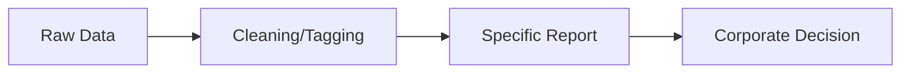
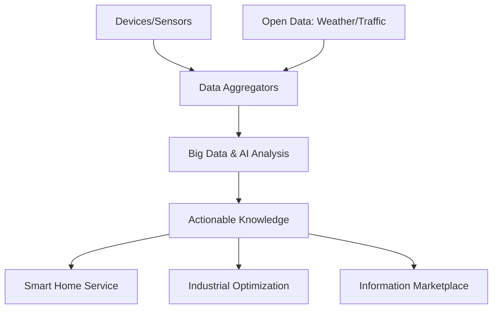

# Module 2: M2M to IoT - The Vision

## 1. Introduction to the Vision
The transition from **Machine-to-Machine (M2M)** to the **Internet of Things (IoT)** represents a fundamental shift in how we connect devices and use the data they generate. While M2M provided the foundation for remote connectivity, the IoT vision expands this into a global, open, and information-driven ecosystem.

### 1.1 The Core Shift: From Silos to Ecosystems
*   **M2M (The "Stovepipe" or "Silo" Model):** Traditional M2M deployments are task-specific and isolated. A device is connected to a single application to solve a specific problem (e.g., a smart meter talking to a utility company's server).
*   **IoT (The "Information Marketplace"):** The IoT vision breaks these silos. Data from a single device can be repurposed, combined with other data sources (like weather or social media), and shared across different industries to create entirely new services.

---

## 2. From M2M to IoT: Evolution
The evolution is driven by several technological and economic factors:
*   **Standardization:** Moving from proprietary protocols to open standards (IP, Web protocols).
*   **Connectivity:** From dedicated point-to-point links to the ubiquitous Internet.
*   **Data Usage:** From single-purpose data to multi-purpose data reuse.

### 2.1 Differing Characteristics
| Feature | M2M | IoT |
| :--- | :--- | :--- |
| **Connectivity** | Point-to-point / Wired or Cellular | IP-based / Diverse (Wi-Fi, Zigbee, etc.) |
| **Data Usage** | Internal/Siloed (Single Application) | Open/Shared (Multiple Applications) |
| **Scalability** | Limited by specific infrastructure | Virtually unlimited via Cloud |
| **Hardware** | Purpose-built/Proprietary | Commodity hardware/Open standards |
| **Value Focus** | Device management & Connectivity | Information & Knowledge creation |

---

## 3. The Global Context
The transition to IoT is happening in a **Global Context**, driven by:
1.  **Urbanization:** Smart City initiatives require cross-industry data sharing (transport, energy, waste).
2.  **Industrialization (Industry 4.0):** Factories need to integrate with supply chains and customer feedback loops.
3.  **Sustainability:** Resource optimization requires a holistic view of data from many sources.

---

## 4. Value Chains: M2M vs. IoT

### 4.1 M2M Value Chain (Linear)
The M2M value chain is typically linear and follows a product-driven approach:

*   **Characteristics:** Proprietary, closed, and serves one specific use case.

### 4.2 IoT Value Chain (Information-Driven)
The IoT value chain is networked and focuses on repurposing data:

*   **Characteristics:** Open, multi-modal, and focuses on the **Information Marketplace** where data itself is a valuable commodity.

---

## 5. An Emerging Industrial Structure for IoT
The industry is moving away from selling physical products toward **Outcome-as-a-Service**.

### 5.1 The Information Value Loop
Value is created by turning raw data into action through a cycle:
1.  **Create:** Sensors generate data.
2.  **Communicate:** Networks move data.
3.  **Aggregate:** Data is combined from various sources.
4.  **Analyze:** Patterns are identified (AI/ML).
5.  **Act:** Automated or human action is taken based on insights.

### 5.2 Horizontalization
Instead of "Vertical Silos" (one company doing everything), the industry is "Horizontalizing":
*   **Device Layer:** Specialized sensor manufacturers.
*   **Platform Layer:** Cloud and connectivity providers (AWS, Azure).
*   **Service Layer:** Data analysts and application developers.

---

## 6. Use Case Example: Asset Tracking

### M2M Approach:
A logistics company installs a GPS tracker on a truck. The tracker sends location data only to the company's internal dashboard so they know where the truck is.

### IoT Approach:
1.  **The Truck:** Becomes an IoT node.
2.  **Shared Data:** Location data is combined with:
    *   **Traffic Data:** To optimize routes in real-time.
    *   **Temperature Data:** To ensure cold-chain compliance for food.
    *   **Insurance:** Shared with insurance companies to lower premiums based on safe driving.
    *   **Manufacturer:** Shared with the truck manufacturer for predictive maintenance.
3.  **Result:** The single data point (location) now serves logistics, safety, insurance, and maintenance sectors simultaneously.

---

## 7. Solved Questions (From Previous Papers)

### Q1. Explain machine-to-machine (M2M) communication and how it differs from IoT. (2025)
**Answer:** M2M refers to the direct communication between devices using any communications channel, including wired or wireless. It is generally point-to-point, siloed, and task-specific. IoT is the evolution of M2M that uses the Internet to connect these devices into a global, open ecosystem where data is shared and reused across multiple applications and industries.

### Q2. Discuss the vision of IoT as per Jan Holler.
**Answer:** The vision is a shift from isolated "stovepipe" M2M systems to an open, integrated environment. It focuses on moving value from the physical device to the information it generates, enabling an "Information Marketplace" where data is repurposed and combined to create new insights and services.

### Q3. Describe the IoT Value Chain.
**Answer:** Unlike the linear M2M value chain, the IoT value chain is a complex network. It includes inputs from diverse sensors and open data sources, aggregation in the cloud, processing through Big Data/AI to create knowledge, and delivering value through cross-industry services.

---

## 8. Self-Generated Practice Questions

### Q1. What is meant by "Stovepipe" or "Silo" in the context of M2M?
**Answer:** It refers to a closed system where a specific set of devices is built to communicate with only one specific application, and the data is not shared or used for any other purpose outside that single "silo."

### Q2. How does "Horizontalization" change the business model for IoT companies?
**Answer:** It allows companies to specialize in a specific layer (like being the best at sensor manufacturing or data analytics) and sell their services to many different industries, rather than having to build and maintain a complete end-to-end proprietary system for every new client.

### Q3. Give an example of how "Open Data" can increase the value of an IoT system.
**Answer:** In a Smart Agriculture system, soil moisture sensors (IoT data) can be combined with open weather forecasts (Open Data). If the forecast predicts heavy rain, the system can automatically cancel scheduled irrigation, saving water and preventing crop damage—a value that moisture sensors alone couldn't provide.
