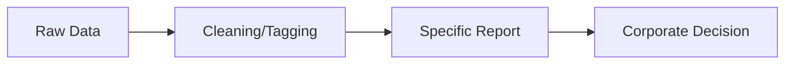
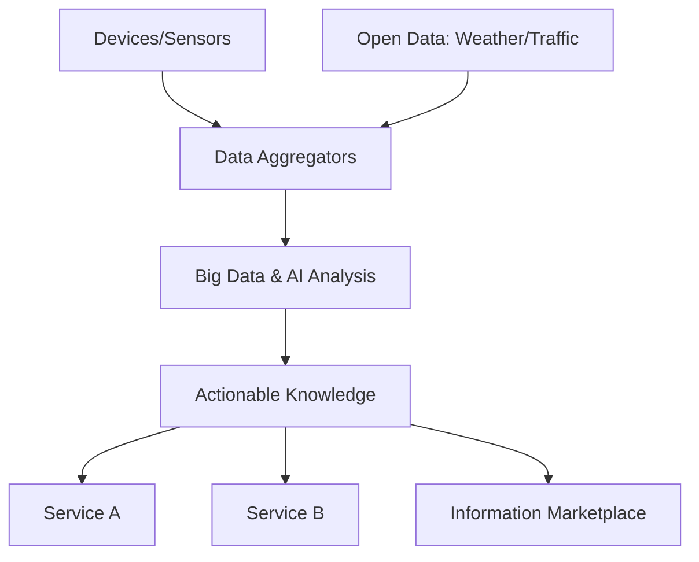

# Module 2: M2M to IoT - The Vision

Syllabus keywords covered: Introduction, from M2M to IoT, M2M towards IoT (global context), use case example, differing characteristics/definitions, M2M value chains, IoT value chains, emerging industrial structure for IoT.

## 1. Introduction to the Vision
**Key idea:** M2M enabled remote monitoring/control for a single purpose. IoT expands this into a global, open, data-driven ecosystem where the same data can create multiple services.

### 1.1 Core Shift: Silos -> Ecosystems
**Notes:**
* **M2M ("stovepipe/silo"):** device(s) -> one application -> one owner/use case; tightly coupled and closed.
* **IoT ("information marketplace"):** device data can be reused, combined with other data, and shared across multiple applications/domains.

#### Exam (6M) Notes: Vision of IoT (Jan Holler) / "Information marketplace"
1. **Start point:** traditional M2M solutions are vertical and isolated (stovepipes).
2. **Vision:** IoT is an open environment where information flows across systems via standard interfaces.
3. **Value shift:** value moves from the physical device to the **information/knowledge** extracted from device data.
4. **Data reuse:** same sensor data can support multiple services (multi-purpose use).
5. **Information marketplace:** multiple stakeholders produce/consume data; data becomes a commodity.
6. **Enablers:** IP connectivity (IPv6), cloud platforms, APIs, analytics/AI, cheap sensors, smartphones.
7. **Outcome:** new cross-domain services + better optimization + faster decisions at scale.

---

## 2. From M2M to IoT: Evolution
### 2.1 Drivers (why the evolution happened)
**Notes (write any 6):**
* **Standardization:** proprietary -> open standards (IP, web, MQTT/CoAP).
* **Connectivity:** point-to-point links -> internet + multi-network connectivity.
* **Cloud platforms:** scalable storage/compute + device management + APIs.
* **Edge computing:** local processing for low latency and bandwidth savings.
* **Big data + AI/ML:** value from patterns (prediction, anomaly detection).
* **Economics:** sensors/MCUs cheaper; connectivity widely available; data monetization.
* **Security maturity:** TLS/DTLS, identity, and OTA patching at scale became practical.

#### Exam (6M) Notes: "Explain the evolution from M2M to IoT"
1. Define M2M and its limitation (single-purpose, siloed).
2. Explain move to IP-based networking (IPv6) and open protocols.
3. Explain cloud/edge role (storage, processing, device mgmt).
4. Explain data reuse and integration with open data sources.
5. Explain analytics/AI converting data into knowledge and outcomes.
6. Conclude with benefits: scalability, interoperability, new services/business models.

### 2.2 Differing Characteristics (M2M vs IoT)
| Feature | M2M | IoT |
| :--- | :--- | :--- |
| **Connectivity** | point-to-point / wired or cellular | IP-based / diverse (Wi-Fi, Zigbee, LPWAN, etc.) |
| **System style** | closed vertical solution | open ecosystem + APIs |
| **Data usage** | internal, single-purpose | shared, multi-purpose (reuse) |
| **Scale** | limited scope | cloud-scale, large deployments |
| **Hardware** | purpose-built/proprietary | commodity hardware + standards |
| **Value focus** | connectivity + device management | information -> knowledge -> services |

#### Exam (6M) Notes: "Differentiate M2M and IoT (vision perspective)"
1. **Scope:** M2M limited endpoints; IoT massive and heterogeneous.
2. **Architecture:** M2M vertical; IoT platform-based (cloud/edge) with APIs.
3. **Internet:** M2M not always internet; IoT typically internet/IP (IPv6).
4. **Data:** M2M siloed; IoT data reuse across services (analytics + ML).
5. **Interoperability:** IoT emphasizes standards and integration.
6. **Example:** M2M meter reading vs IoT smart city where the same data supports many departments.

---

## 3. M2M Towards IoT: The Global Context
**Notes (why IoT is global):**
1. **Urbanization:** smart transport, energy, waste, safety need cross-domain data sharing.
2. **Industry 4.0:** connected machines + supply chains + quality + predictive maintenance.
3. **Sustainability:** energy/water optimization and emissions monitoring need holistic data.
4. **Healthcare + aging population:** remote monitoring + preventive care.
5. **Policy/compliance:** traceability and continuous monitoring (safety, environment).

#### Exam (6M) Notes: "Explain the global context for IoT adoption"
1. Start with need for **cross-industry data sharing** (not supported by stovepipes).
2. Smart cities: multi-stakeholder example (traffic + energy + safety).
3. Industry 4.0: connected production, maintenance, quality loops.
4. Sustainability: continuous measurement + optimization across sectors.
5. Enabling infrastructure: cloud, wireless (5G/LPWAN), cheap sensors.
6. Conclusion: global scale + open standards make IoT viable and impactful.

---

## 4. Value Chains: M2M vs IoT

### 4.1 M2M Value Chain (Linear)

**Notes:**
* Proprietary, closed, and tied to one use case.
* Revenue mostly from devices + connectivity + system integration projects.

### 4.2 IoT Value Chain (Information-Driven / Networked)

**Notes:**
* Multi-source input; multi-consumer outputs; data reuse across domains.
* Value comes from insights, automation, and outcomes (not just the device).

#### Exam (6M) Notes: "Explain M2M value chain vs IoT value chain"
1. **M2M:** linear pipeline; data used for one report/decision.
2. **IoT:** networked pipeline; multiple data sources + multiple consumers.
3. **IoT adds platform layer:** ingestion, storage, device management, APIs.
4. **Analytics role:** converts data -> knowledge -> actions/services.
5. **Monetization:** IoT enables outcome-based services and data marketplace models.
6. **Example:** vehicle location data used for logistics + insurance + maintenance (IoT).

---

## 5. Emerging Industrial Structure for IoT
**Notes:**
* Shift from product selling to **Outcome-as-a-Service** (uptime, efficiency, energy savings).
* Shift from vertical silos to horizontal layers with specialization.

### 5.1 The Information Value Loop
**Loop (remember as C-C-A-A-A-F):**
1. **Create:** sensors generate data.
2. **Communicate:** networks move data.
3. **Aggregate:** combine multiple sources (devices + open data).
4. **Analyze:** analytics/AI find patterns and predictions.
5. **Act:** automation or human decision.
6. **Feedback:** actions change the system -> new data (loop continues).

#### Exam (6M) Notes: "Explain the information value loop"
1. Define the loop: continuous conversion of data into outcomes.
2. Explain each stage briefly (create, communicate, aggregate, analyze, act, feedback).
3. Mention where value is created (analysis + action).
4. Mention continuous improvement/learning (feedback).
5. Mention edge+cloud as places where loop executes.
6. Example: predictive maintenance loop for a motor (vibration -> predict -> maintain -> reduced downtime).

### 5.2 Horizontalization (Layer-wise Industry)
**Notes (layers and players):**
* **Device layer:** OEMs, sensor/module vendors.
* **Connectivity layer:** telecom, LPWAN providers, enterprise networks.
* **Platform layer:** cloud IoT platforms, device management, data ingestion, digital twins.
* **Service layer:** analytics, application developers, system integrators.

#### Exam (6M) Notes: "Explain horizontalization in IoT"
1. Define horizontalization: specialization by layer rather than end-to-end vertical silos.
2. Why it happens: reuse across industries, faster innovation, lower cost.
3. Explain the main layers (device, connectivity, platform, service).
4. Benefits: interoperability, scalability, ecosystem growth.
5. Challenges: integration complexity, vendor lock-in risk, security boundaries between layers.
6. Example: one vendor supplies sensors, another provides platform, a third builds apps for multiple domains.

---

## 6. Use Case Example: Asset Tracking (M2M vs IoT)

### 6.1 M2M Approach (Silo)
**Notes:**
* GPS tracker -> internal dashboard only.
* One purpose: "Where is my truck?"

### 6.2 IoT Approach (Ecosystem)
**Notes:**
1. Truck becomes an IoT node (GPS + sensors).
2. Location data combined with:
   * traffic -> route optimization
   * temperature -> cold-chain compliance
   * driving behavior -> insurance premium optimization
   * engine health -> predictive maintenance
3. One dataset supports multiple stakeholders and services.

#### Exam (6M) Notes: "Explain a use case showing M2M to IoT shift"
1. Describe the M2M system (single owner, single use, closed).
2. Add more data sources (open data + other sensors).
3. Add platform/analytics step (aggregation + processing).
4. Add multiple consumers (logistics, insurance, OEM, compliance).
5. State benefits: optimization, compliance, safety, predictive maintenance.
6. Conclude: demonstrates data reuse and information marketplace.

---

## 7. Solved Questions (From Previous Papers)

### Q1. Explain M2M communication and how it differs from IoT. (2025)
**Answer (points):**
* M2M: direct device-to-device or device-to-server communication for a fixed task; often siloed.
* IoT: IP + platforms + APIs + analytics, enabling cross-application data sharing and reuse.
* IoT adds: device management at scale, interoperability, and information marketplace models.

### Q2. Discuss the vision of IoT as per Jan Holler.
**Answer (points):**
* Move from stovepipe M2M to open integrated ecosystem.
* Value shifts from device to information/knowledge.
* Data reuse and combination enables new services (information marketplace).

### Q3. Describe the IoT Value Chain.
**Answer (points):**
* Devices + open data -> aggregation -> analytics/AI -> knowledge -> services across domains.
* Non-linear, multi-stakeholder, information-driven.

---

## 8. Self-Generated Practice Questions

### Q1. What is meant by "Stovepipe" or "Silo" in M2M?
**Answer:** Closed vertical system where devices communicate with one specific application only; data is not shared outside the use case.

### Q2. How does "Horizontalization" change IoT business models?
**Answer:** Companies specialize by layer (device/connectivity/platform/service) and sell reusable components across industries instead of building a full proprietary end-to-end stack for every customer.

### Q3. Give an example where "Open Data" increases IoT value.
**Answer:** Smart agriculture: soil moisture sensors + weather forecast data -> irrigation is adjusted automatically (skip watering if rain is predicted), saving water and improving crop outcomes.
