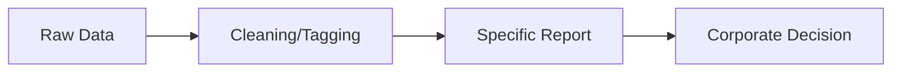
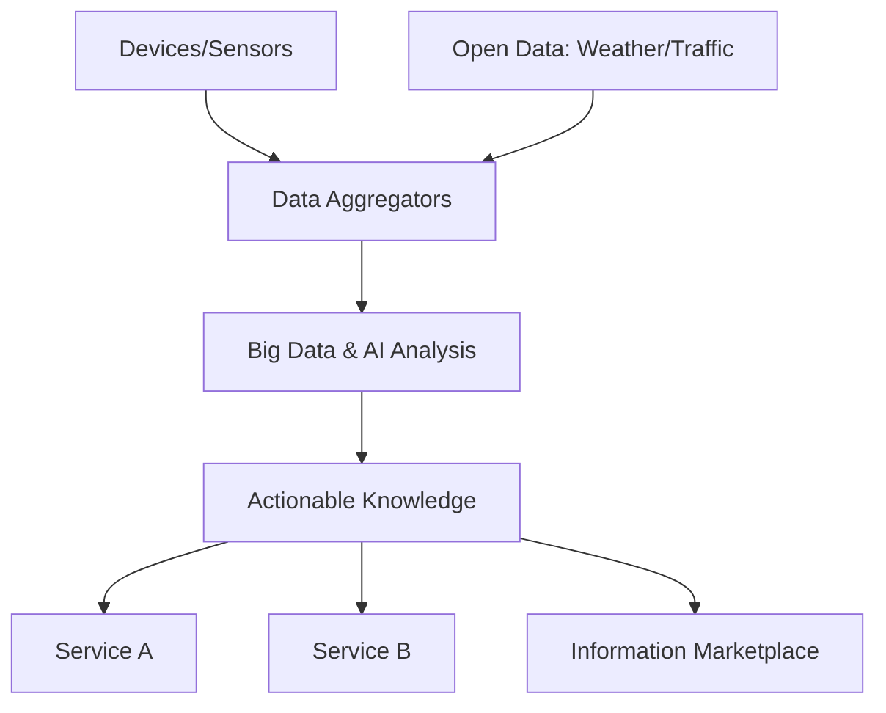
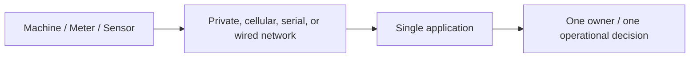
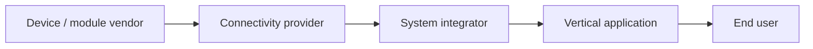
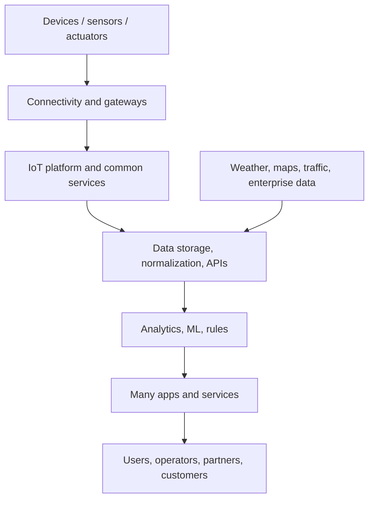

# Module 2: M2M to IoT - The Vision

Syllabus keywords covered: Introduction, from M2M to IoT, M2M towards IoT (global context), use case example, differing characteristics/definitions, M2M value chains, IoT value chains, emerging industrial structure for IoT.

## 1. Introduction to the Vision
**Key idea:** M2M enabled remote monitoring/control for a single purpose. IoT expands this into a global, open, data-driven ecosystem where the same data can create multiple services.

### 1.1 Core Shift: Silos -> Ecosystems
**Notes:**
* **M2M ("stovepipe/silo"):** device(s) -> one application -> one owner/use case; tightly coupled and closed.
* **IoT ("information marketplace"):** device data can be reused, combined with other data, and shared across multiple applications/domains.

#### Exam (6M) Notes: Vision of IoT (Jan Holler) / "Information marketplace"
1. **Start point:** traditional M2M solutions are vertical and isolated (stovepipes).
2. **Vision:** IoT is an open environment where information flows across systems via standard interfaces.
3. **Value shift:** value moves from the physical device to the **information/knowledge** extracted from device data.
4. **Data reuse:** same sensor data can support multiple services (multi-purpose use).
5. **Information marketplace:** multiple stakeholders produce/consume data; data becomes a commodity.
6. **Enablers:** IP connectivity (IPv6), cloud platforms, APIs, analytics/AI, cheap sensors, smartphones.
7. **Outcome:** new cross-domain services + better optimization + faster decisions at scale.

---

## 2. From M2M to IoT: Evolution
### 2.1 Drivers (why the evolution happened)
**Notes (write any 6):**
* **Standardization:** proprietary -> open standards (IP, web, MQTT/CoAP).
* **Connectivity:** point-to-point links -> internet + multi-network connectivity.
* **Cloud platforms:** scalable storage/compute + device management + APIs.
* **Edge computing:** local processing for low latency and bandwidth savings.
* **Big data + AI/ML:** value from patterns (prediction, anomaly detection).
* **Economics:** sensors/MCUs cheaper; connectivity widely available; data monetization.
* **Security maturity:** TLS/DTLS, identity, and OTA patching at scale became practical.

#### Exam (6M) Notes: "Explain the evolution from M2M to IoT"
1. Define M2M and its limitation (single-purpose, siloed).
2. Explain move to IP-based networking (IPv6) and open protocols.
3. Explain cloud/edge role (storage, processing, device mgmt).
4. Explain data reuse and integration with open data sources.
5. Explain analytics/AI converting data into knowledge and outcomes.
6. Conclude with benefits: scalability, interoperability, new services/business models.

### 2.2 Differing Characteristics (M2M vs IoT)
| Feature | M2M | IoT |
| :--- | :--- | :--- |
| **Connectivity** | point-to-point / wired or cellular | IP-based / diverse (Wi-Fi, Zigbee, LPWAN, etc.) |
| **System style** | closed vertical solution | open ecosystem + APIs |
| **Data usage** | internal, single-purpose | shared, multi-purpose (reuse) |
| **Scale** | limited scope | cloud-scale, large deployments |
| **Hardware** | purpose-built/proprietary | commodity hardware + standards |
| **Value focus** | connectivity + device management | information -> knowledge -> services |

#### Exam (6M) Notes: "Differentiate M2M and IoT (vision perspective)"
1. **Scope:** M2M limited endpoints; IoT massive and heterogeneous.
2. **Architecture:** M2M vertical; IoT platform-based (cloud/edge) with APIs.
3. **Internet:** M2M not always internet; IoT typically internet/IP (IPv6).
4. **Data:** M2M siloed; IoT data reuse across services (analytics + ML).
5. **Interoperability:** IoT emphasizes standards and integration.
6. **Example:** M2M meter reading vs IoT smart city where the same data supports many departments.

---

## 3. M2M Towards IoT: The Global Context
**Notes (why IoT is global):**
1. **Urbanization:** smart transport, energy, waste, safety need cross-domain data sharing.
2. **Industry 4.0:** connected machines + supply chains + quality + predictive maintenance.
3. **Sustainability:** energy/water optimization and emissions monitoring need holistic data.
4. **Healthcare + aging population:** remote monitoring + preventive care.
5. **Policy/compliance:** traceability and continuous monitoring (safety, environment).

#### Exam (6M) Notes: "Explain the global context for IoT adoption"
1. Start with need for **cross-industry data sharing** (not supported by stovepipes).
2. Smart cities: multi-stakeholder example (traffic + energy + safety).
3. Industry 4.0: connected production, maintenance, quality loops.
4. Sustainability: continuous measurement + optimization across sectors.
5. Enabling infrastructure: cloud, wireless (5G/LPWAN), cheap sensors.
6. Conclusion: global scale + open standards make IoT viable and impactful.

---

## 4. Value Chains: M2M vs IoT

### 4.1 M2M Value Chain (Linear)

**Notes:**
* Proprietary, closed, and tied to one use case.
* Revenue mostly from devices + connectivity + system integration projects.

### 4.2 IoT Value Chain (Information-Driven / Networked)

**Notes:**
* Multi-source input; multi-consumer outputs; data reuse across domains.
* Value comes from insights, automation, and outcomes (not just the device).

#### Exam (6M) Notes: "Explain M2M value chain vs IoT value chain"
1. **M2M:** linear pipeline; data used for one report/decision.
2. **IoT:** networked pipeline; multiple data sources + multiple consumers.
3. **IoT adds platform layer:** ingestion, storage, device management, APIs.
4. **Analytics role:** converts data -> knowledge -> actions/services.
5. **Monetization:** IoT enables outcome-based services and data marketplace models.
6. **Example:** vehicle location data used for logistics + insurance + maintenance (IoT).

---

## 5. Emerging Industrial Structure for IoT
**Notes:**
* Shift from product selling to **Outcome-as-a-Service** (uptime, efficiency, energy savings).
* Shift from vertical silos to horizontal layers with specialization.

### 5.1 The Information Value Loop
**Loop (remember as C-C-A-A-A-F):**
1. **Create:** sensors generate data.
2. **Communicate:** networks move data.
3. **Aggregate:** combine multiple sources (devices + open data).
4. **Analyze:** analytics/AI find patterns and predictions.
5. **Act:** automation or human decision.
6. **Feedback:** actions change the system -> new data (loop continues).

#### Exam (6M) Notes: "Explain the information value loop"
1. Define the loop: continuous conversion of data into outcomes.
2. Explain each stage briefly (create, communicate, aggregate, analyze, act, feedback).
3. Mention where value is created (analysis + action).
4. Mention continuous improvement/learning (feedback).
5. Mention edge+cloud as places where loop executes.
6. Example: predictive maintenance loop for a motor (vibration -> predict -> maintain -> reduced downtime).

### 5.2 Horizontalization (Layer-wise Industry)
**Notes (layers and players):**
* **Device layer:** OEMs, sensor/module vendors.
* **Connectivity layer:** telecom, LPWAN providers, enterprise networks.
* **Platform layer:** cloud IoT platforms, device management, data ingestion, digital twins.
* **Service layer:** analytics, application developers, system integrators.

#### Exam (6M) Notes: "Explain horizontalization in IoT"
1. Define horizontalization: specialization by layer rather than end-to-end vertical silos.
2. Why it happens: reuse across industries, faster innovation, lower cost.
3. Explain the main layers (device, connectivity, platform, service).
4. Benefits: interoperability, scalability, ecosystem growth.
5. Challenges: integration complexity, vendor lock-in risk, security boundaries between layers.
6. Example: one vendor supplies sensors, another provides platform, a third builds apps for multiple domains.

---

## 6. Use Case Example: Asset Tracking (M2M vs IoT)

### 6.1 M2M Approach (Silo)
**Notes:**
* GPS tracker -> internal dashboard only.
* One purpose: "Where is my truck?"

### 6.2 IoT Approach (Ecosystem)
**Notes:**
1. Truck becomes an IoT node (GPS + sensors).
2. Location data combined with:
   * traffic -> route optimization
   * temperature -> cold-chain compliance
   * driving behavior -> insurance premium optimization
   * engine health -> predictive maintenance
3. One dataset supports multiple stakeholders and services.

#### Exam (6M) Notes: "Explain a use case showing M2M to IoT shift"
1. Describe the M2M system (single owner, single use, closed).
2. Add more data sources (open data + other sensors).
3. Add platform/analytics step (aggregation + processing).
4. Add multiple consumers (logistics, insurance, OEM, compliance).
5. State benefits: optimization, compliance, safety, predictive maintenance.
6. Conclude: demonstrates data reuse and information marketplace.

---

## 7. Solved Questions (From Previous Papers)

### Q1. Explain M2M communication and how it differs from IoT. (2025)
**Answer (points):**
* M2M: direct device-to-device or device-to-server communication for a fixed task; often siloed.
* IoT: IP + platforms + APIs + analytics, enabling cross-application data sharing and reuse.
* IoT adds: device management at scale, interoperability, and information marketplace models.

### Q2. Discuss the vision of IoT as per Jan Holler.
**Answer (points):**
* Move from stovepipe M2M to open integrated ecosystem.
* Value shifts from device to information/knowledge.
* Data reuse and combination enables new services (information marketplace).

### Q3. Describe the IoT Value Chain.
**Answer (points):**
* Devices + open data -> aggregation -> analytics/AI -> knowledge -> services across domains.
* Non-linear, multi-stakeholder, information-driven.

---

## 8. Self-Generated Practice Questions

### Q1. What is meant by "Stovepipe" or "Silo" in M2M?
**Answer:** Closed vertical system where devices communicate with one specific application only; data is not shared outside the use case.

### Q2. How does "Horizontalization" change IoT business models?
**Answer:** Companies specialize by layer (device/connectivity/platform/service) and sell reusable components across industries instead of building a full proprietary end-to-end stack for every customer.

### Q3. Give an example where "Open Data" increases IoT value.
**Answer:** Smart agriculture: soil moisture sensors + weather forecast data -> irrigation is adjusted automatically (skip watering if rain is predicted), saving water and improving crop outcomes.

---

## 9. Book-Based Deep Expansion for Every Module 2 Topic

Source basis: `Full book.pdf`, mainly Chapter 1 (`What Is IoT?`) and Chapter 2 (`IoT Network Architecture and Design`), with supporting ideas from Chapter 6 (`Application Protocols for IoT`) and Chapter 7 (`Data and Analytics for IoT`). This section expands the M2M-to-IoT vision using the book's architecture language.

### 9.1 The Real Vision: From Connectivity to Data Value
The book treats IoT as the next phase of Internet evolution: the earlier Internet connected people, businesses, applications, and digital media; IoT connects physical things and makes their data usable. Traditional M2M already connected machines, but mostly for one fixed operational purpose. IoT expands this into a system where machine data can be transported, normalized, analyzed, reused, and acted on by many applications.

The strongest distinction is this:
- **M2M value:** "Can this machine report to its application?"
- **IoT value:** "Can this physical-world data become reusable knowledge across many services?"

This means the value shifts upward:
1. Device connectivity is necessary but not sufficient.
2. Data collection creates visibility.
3. Aggregation creates context.
4. Analytics creates insight.
5. Applications convert insight into action.
6. Business processes convert action into measurable value.

**Repeated concept reference:** The sense-to-action loop is explained in Module 1 Section 13.1. Module 2 focuses on why that loop changes business and industry structure.

### 9.2 M2M as the Starting Point
Machine-to-Machine communication is automated communication between devices, machines, controllers, meters, or remote systems with minimal human intervention. In older deployments, an M2M system commonly used a direct or vertical structure:

Typical M2M examples:
- vending machine reports inventory to the operator;
- smart meter sends readings to a utility billing system;
- ATM or PoS terminal reports transaction status;
- industrial PLC sends alarms to a SCADA master;
- vehicle GPS tracker reports truck location to a fleet dashboard.

M2M is useful, but its weakness is vertical isolation. The device, network, protocol, data format, and application are often tightly coupled. Reusing the same data for a new purpose may require new integration work or even a separate deployment.

### 9.3 IoT as the Expansion of M2M
The book explains that IoT architectures are driven by data, scale, constrained devices, security, and legacy support. These drivers push M2M systems toward open, layered, horizontal architectures.

An IoT version of the same system looks like this:

The same physical data can now support multiple consumers. For example, vehicle location data can support route optimization, delivery ETA, driver safety, insurance scoring, theft detection, predictive maintenance, and customer notifications.

### 9.4 "Stovepipe" vs Horizontal Architecture
A stovepipe system is a closed vertical solution where each application has its own devices, network, protocol, data model, and backend. It works for a single use case but wastes data and increases cost when many use cases are needed.

Problems with stovepipes:
- duplicate sensors for similar measurements;
- poor interoperability between vendors;
- separate management tools;
- inconsistent security models;
- data locked inside one application;
- high integration cost for new services;
- difficult scaling across departments or industries.

Horizontal IoT architecture solves this by introducing common layers. oneM2M is the book's key example: it uses a common services layer that can be shared by many vertical applications. Applications remain industry-specific, but device management, communication, service exposure, and APIs become reusable.

**Exam line:** M2M is vertical and purpose-specific; IoT is horizontal, platform-based, and data-reuse-oriented.

### 9.5 Global Context: Why the Shift Became Necessary
The book gives several reasons why traditional IT architectures and traditional M2M are not enough.

**Scale:** IoT deployments may require millions of routable endpoints. This is closer to service-provider scale than enterprise LAN scale. IPv6 becomes a natural foundation.

**Security:** IoT endpoints are often physically exposed, wireless, remote, and sometimes deployed in critical infrastructure. Security cannot rely only on a perimeter firewall. Identity, authentication, encryption, anomaly detection, and network-level policy are required.

**Constrained devices:** Many sensors have limited power, CPU, memory, and bandwidth. They cannot behave like laptops or servers. Protocols and architectures must respect low power and lossy networks.

**Data volume:** IoT is "all about the data." Architectures must stagger data processing across edge, fog, and cloud so that unnecessary raw data is filtered before overwhelming central systems.

**Legacy support:** OT devices may remain deployed for decades. IoT must integrate serial devices, non-IP protocols, and legacy SCADA systems through gateways, tunneling, and protocol translation.

These reasons explain the global move from closed M2M systems to layered IoT ecosystems.

### 9.6 IT/OT Convergence in the M2M-to-IoT Vision
The book's IT/OT discussion is essential for Module 2. Traditional M2M often lived inside OT: factories, utilities, transport systems, meters, industrial controllers, and SCADA networks. IoT forces OT data to become useful to IT systems such as cloud platforms, enterprise analytics, dashboards, billing, customer applications, compliance systems, and business intelligence.

The convergence is not just technical; it is organizational:
- OT cares about safety, availability, deterministic operation, and physical process continuity.
- IT cares about data security, integration, applications, governance, and enterprise scalability.
- IoT needs both: safe physical operation plus enterprise-grade data use.

Example: A factory vibration sensor is OT when it protects a motor from failure. It becomes IoT when its data also feeds predictive maintenance dashboards, spare-parts planning, energy optimization, quality analytics, and enterprise asset management.

### 9.7 Value Chain: M2M Linear Chain
The M2M value chain is usually linear:

Value is concentrated in:
- hardware modules;
- connectivity contracts;
- installation/integration;
- one application;
- operational reporting.

This value chain is simple but limited. It does not naturally create data marketplaces, cross-domain analytics, or multi-application reuse.

### 9.8 Value Chain: IoT Networked Chain
The IoT value chain is networked rather than linear:

Value expands because:
- data from many sources can be combined;
- one dataset can support many applications;
- APIs allow third-party innovation;
- analytics creates predictions rather than only reports;
- automation closes the loop with actuators and workflows;
- business models can shift to outcomes such as uptime, energy saving, safety, or compliance.

**Repeated concept reference:** IoT data brokers are explained in Module 1 Section 13.24. They are one technical mechanism that enables this value chain.

### 9.9 Information Value Loop
The information value loop is the cleanest way to write a high-scoring answer on the IoT industrial structure.

| Stage | Meaning | Example in predictive maintenance |
| :--- | :--- | :--- |
| Create | Sensors produce raw data | vibration sensor samples motor vibration |
| Communicate | Network transports data | gateway sends data using MQTT/IP |
| Aggregate | Data from multiple sources is combined | vibration + temperature + machine age |
| Analyze | Algorithms detect patterns | model predicts bearing failure |
| Act | Human/software triggers response | maintenance ticket is created |
| Feedback | Result improves future decisions | repair outcome improves prediction model |

The loop shows that IoT value is not in raw data alone. Value appears when data changes a decision or action.

### 9.10 Information Marketplace
An information marketplace is a model where data producers and data consumers interact through platforms, APIs, brokers, and policies. Data becomes a reusable asset.

Example: A connected vehicle generates location, speed, engine, tire, fuel, temperature, and driver-behavior data. Possible consumers include:
- fleet operator for routing and ETA;
- vehicle manufacturer for design improvement;
- insurance provider for risk pricing;
- maintenance provider for failure prediction;
- city authority for traffic planning;
- customer app for delivery tracking.

The same data stream therefore creates multiple services. This is the main difference between IoT and older M2M.

### 9.11 Use Case: Asset Tracking as M2M and IoT
**M2M version:** A GPS tracker sends truck location to a fleet dashboard. The answer is "where is my truck?" This is useful but narrow.

**IoT version:** The truck is treated as a connected asset with multiple data sources:
- GPS location;
- cargo temperature;
- door open/close events;
- fuel level;
- engine health;
- driver behavior;
- traffic and weather data;
- route history.

Multiple services emerge:
- route optimization;
- cold-chain compliance;
- theft detection;
- predictive maintenance;
- driver safety scoring;
- customer ETA notifications;
- fuel-efficiency analytics;
- insurance optimization.

This demonstrates the exact M2M-to-IoT transition: one-purpose telemetry becomes a multi-service data ecosystem.

### 9.12 Use Case: Smart Building
Traditional building systems often have separate networks for HVAC, lighting, fire detection, access control, and CCTV. This is a stovepipe pattern. IoT connects these systems through IP, gateways, shared data models, and applications.

Example data reuse:
- Occupancy sensors turn lights on/off.
- The same occupancy data controls HVAC air flow.
- The same data supports security patrol planning.
- The same data supports office space optimization.
- Energy analytics compares occupancy with electricity use.

The book's digital-ceiling example is a strong illustration: LED lights connected through PoE become network endpoints and sensor locations. Lighting infrastructure becomes a platform for occupancy sensing, comfort control, and building analytics.

### 9.13 Use Case: Smart Agriculture
In a simple M2M deployment, a soil moisture sensor may report readings to one irrigation controller. In an IoT deployment, the same data is combined with weather forecasts, soil pH, nutrient levels, salinity, crop type, irrigation history, and yield models.

Possible actions:
- open/close water valves;
- adjust fertilizer dosing;
- skip irrigation before predicted rain;
- detect soil degradation;
- predict crop yield;
- alert farmer about abnormal conditions.

This shows how sensors plus actuators plus analytics create a closed control loop.

### 9.14 Emerging Industrial Structure
IoT pushes industry from vertical end-to-end stacks toward horizontal specialization.

| Layer | Players | What they provide |
| :--- | :--- | :--- |
| Device layer | OEMs, chip vendors, sensor vendors | sensors, actuators, embedded systems |
| Connectivity layer | telecom, LPWAN, Wi-Fi, enterprise network providers | local and wide-area transport |
| Gateway/edge layer | gateway vendors, industrial router vendors | aggregation, protocol translation, local processing |
| Platform layer | cloud IoT, oneM2M-like service layers | device management, ingestion, APIs, storage |
| Data/analytics layer | AI/ML, big data, stream analytics vendors | prediction, optimization, anomaly detection |
| Application layer | app developers, domain vendors, integrators | dashboards, workflows, domain solutions |
| Business layer | service providers, enterprises, governments | outcomes, governance, monetization |

The most important shift is that value moves from selling hardware to selling outcomes: uptime, reduced energy use, fewer failures, safety, compliance, and improved customer experience.

### 9.15 Security in the Vision
M2M security was often limited to closed networks or private links. IoT cannot depend on isolation because devices connect to IP networks, cloud services, APIs, and multiple stakeholders.

Book-aligned security needs:
- identify and authenticate all entities: devices, gateways, networks, platforms, users;
- encrypt user and telemetry data;
- comply with data protection laws;
- apply rules-based security policies;
- monitor anomalous behavior;
- use a holistic network-level approach;
- secure transition points between architecture layers.

Security is therefore not a separate add-on. It is part of the IoT value chain because data cannot be reused safely without trust, identity, and access control.

### 9.16 Data Management in the Vision
The book says IoT architectures stagger data consumption throughout the system. This means every reading should not automatically be pushed unchanged to the cloud.

Data handling levels:
- **Device/edge:** sample, filter, compress, threshold.
- **Gateway/fog:** aggregate, translate protocol, normalize data, buffer outages.
- **Cloud/platform:** store, analyze, train models, expose APIs.
- **Application/business:** visualize, alert, automate, optimize.

This solves three problems:
1. Reduces bandwidth.
2. Reduces cloud processing cost.
3. Improves response time for local actions.

### 9.17 Final Exam Comparison: M2M vs IoT
| Basis | M2M | IoT |
| :--- | :--- | :--- |
| Design style | vertical/stovepipe | horizontal/platform |
| Main purpose | remote monitoring/control | data reuse, analytics, automation, services |
| Connectivity | private, cellular, serial, proprietary, sometimes IP | IP/IPv6 plus many access technologies |
| Application count | usually one | many applications can consume same data |
| Data model | application-specific | normalized/shared through APIs/brokers |
| Scale | limited deployment | city/industry/global scale |
| Integration | custom | standards, middleware, common services |
| Value | device + connectivity + report | information + insight + outcome |
| Example | meter reading for billing | smart grid optimization, outage prediction, demand response, billing |

### 9.18 6-Mark Answer Template
Use this structure for any "M2M to IoT" question:
1. Define M2M as fixed machine communication.
2. State its limitation: stovepipe, single-purpose, poor reuse.
3. Define IoT as connected things plus IP/platforms/analytics.
4. Explain horizontal architecture and common services.
5. Explain data reuse/information marketplace.
6. Give one use case: vehicle, smart building, smart agriculture, smart meter.
7. Conclude with outcomes: scalability, interoperability, automation, new services.
