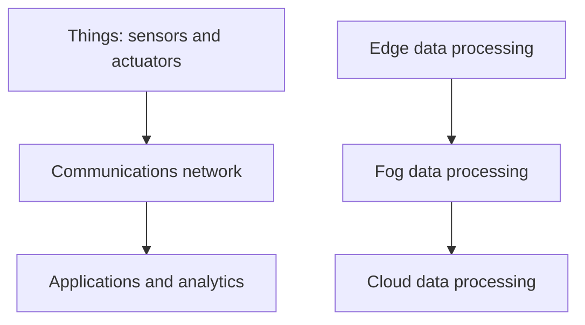
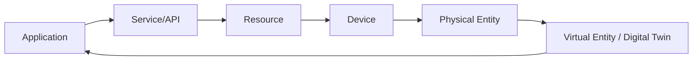

# Module 3: M2M vs IoT - An Architectural Overview

Syllabus keywords covered: Building architecture, main design principles and needed capabilities, IoT architecture outline and standards considerations, reference architecture and reference model of IoT, IoT reference architecture views (functional/information/operational/deployment), constraints affecting design (intro + technical design constraints).

## 1. Building the Architecture: From M2M to IoT
**Core shift:** vertical silos -> horizontal, reusable framework (platform + APIs).

### 1.1 M2M Architecture vs IoT Architecture (Quick Notes)
* **M2M:** closed/proprietary, app-specific; changing app often requires changing stack (device + network + backend).
* **IoT:** open/multipurpose; decouples device/network from apps; data can be reused by many services.

#### Exam (6M) Notes: "Explain the architectural transition from M2M to IoT"
1. Start with M2M limitations: siloed, point solutions, limited interoperability.
2. Explain IoT goal: cross-domain integration + reusable services + platform approach.
3. Explain decoupling: devices produce data; many apps consume via standardized interfaces.
4. Mention key building blocks: things/devices, gateways/edge, networks, cloud platform, apps.
5. Mention cross-cutting concerns: security, management, interoperability.
6. Conclude with outcomes: scalability, data reuse, new services and business models.

---

## 2. Main Design Principles + Needed Capabilities

### 2.1 Design Principles (High Yield)
**Notes:**
1. **Abstraction of complexity:** hide sensor/protocol details; expose simple APIs/virtual entities.
2. **Resource/data reusability:** one resource should serve multiple apps (break silos).
3. **Scalability:** handle huge device count + message volume (cloud-scale design).
4. **Security & privacy by design:** security in every layer; privacy policies and access control.
5. **Interoperability:** open standards, common data models, protocol translation where needed.
6. **Energy efficiency:** support constrained nodes (sleep cycles, lightweight protocols).
7. **Reliability:** tolerate lossy networks; buffering, retries, idempotent operations.

#### Exam (6M) Notes: "Main design principles for IoT architecture"
1. **Abstraction:** use middleware/services so apps don't depend on hardware/protocol specifics.
2. **Reusability:** share data/resources across apps (e.g., street sensor used by many departments).
3. **Scalability:** horizontal scaling, partitioning, load balancing, message brokering.
4. **Security:** identity, authentication, authorization, encryption, secure boot, OTA patches.
5. **Interoperability:** standard protocols + gateway translation + semantic data models.
6. **Energy efficiency:** lightweight messaging (MQTT/CoAP), duty-cycling, edge filtering.
7. Add a concluding line: these principles reduce cost and enable multi-stakeholder ecosystems.

---

## 3. IoT Architecture Outline + Standards Considerations

### 3.1 Typical IoT Architecture Outline (Conceptual)
**Notes (end-to-end):**
* **Asset/Things:** physical entity (room, machine, patient).
* **Device/Resource:** sensors/actuators + firmware resources.
* **Network:** Wi-Fi/ethernet/cellular/LPWAN + IP routing.
* **Gateway/Edge:** aggregation, translation, local rules, buffering.
* **Platform/Services:** ingestion, device management, storage, analytics, rules engine, APIs.
* **Applications:** dashboards, alerts, automation workflows, enterprise integration.

#### Exam (6M) Notes: "Draw/explain an IoT architecture outline"
1. List the layers (things -> device/resource -> network -> gateway/edge -> platform -> application).
2. Explain data flow: sensing -> transmission -> ingestion -> storage/analytics -> decision -> actuation/alerts.
3. Mention management flow: provisioning, configuration, monitoring, OTA updates.
4. Mention security flow: identity, authZ, encryption across the pipeline.
5. Mention edge role for latency and bandwidth saving.
6. Conclude with why outline matters: clear separation of concerns and scalability.

### 3.2 Standards Considerations (Why standards matter)
**Notes:**
* Prevent vendor lock-in.
* Enable interoperability and global connectivity.
* Reduce cost via commodity components.
* Provide common rules for security and messaging.

**Common standards bodies (exam keywords):**
* **IEEE:** PHY/MAC (Wi-Fi 802.11, Ethernet 802.3, 802.15.*).
* **IETF:** IP stack, IPv6, 6LoWPAN, CoAP.
* **ITU-T:** reference models/architectural recommendations.
* **oneM2M:** service layer / common service functions for M2M/IoT.

#### Exam (6M) Notes: "Explain standards considerations in IoT"
1. Define why standards are required (multi-vendor ecosystem).
2. Mention interoperability and integration benefits.
3. Mention cost and adoption benefits (commodity hardware, reusable platforms).
4. Mention security baseline (standardized crypto and identity approaches).
5. Name standard bodies and what they cover (IEEE/IETF/ITU-T/oneM2M).
6. Conclude: standards make IoT scalable, portable, and future-proof.

---

## 4. Reference Model vs Reference Architecture (Exam Favorite)

### 4.1 IoT Reference Model (What + Why)
**Notes:**
* Conceptual abstraction: entities, relationships, vocabulary.
* Helps different teams/vendors talk the same language.

### 4.2 IoT Reference Architecture (How)
**Notes:**
* Blueprint showing components, interfaces, views, and interactions.
* Derived/consistent with the reference model.

#### Exam (6M) Notes: "Differentiate reference model and reference architecture"
1. **Reference model:** conceptual, technology-agnostic; defines entities and relations.
2. **Reference architecture:** structural blueprint; maps functions to components and interfaces.
3. Model guides understanding; architecture guides implementation.
4. Model is abstract; architecture shows interactions (deployment + operational aspects).
5. Architecture can vary by use case; model remains stable across domains.
6. Benefit: reduces ambiguity and improves interoperability across vendors.

---

## 5. IoT Reference Model (Key Sub-Models)

### 5.1 Domain Model (Entities)
**Notes (definitions):**
* **Physical Entity:** real-world object (machine, room, patient).
* **Virtual Entity:** digital representation/digital twin (state + attributes).
* **Device:** hardware bridge (sensors/actuators) connecting physical to digital.
* **Resource:** software component exposing device capability (read sensor, drive actuator).
* **Service:** network-accessible interface/API for apps (REST/MQTT topic interface).

#### Exam (6M) Notes: "Explain IoT domain model"
1. Define physical entity and virtual entity (digital twin concept).
2. Explain device role (sensing/actuation).
3. Explain resource role (software abstraction, local access to hardware).
4. Explain service role (standard interface for applications).
5. Explain relationship: apps -> services -> resources -> devices -> physical entities; virtual entity stores current state.
6. Give one example (smart room): room (physical), room twin (virtual), sensors (device), read-temp (resource), `/room/1/temp` (service).

### 5.2 Functional Model (Functional Groups)
**Notes (functional groups):**
* **Device FG:** sensing, actuation, local processing.
* **Communication FG:** networking and data transfer.
* **IoT Service FG:** resource/service exposure, discovery, brokering.
* **Virtual Entity FG:** mapping physical <-> virtual; digital twin maintenance.
* **Security FG:** identity, authentication/authorization, integrity/confidentiality.
* **Management FG:** provisioning, configuration, monitoring, OTA updates.

#### Exam (6M) Notes: "Explain IoT functional model"
1. Define functional model (groups needed to build a complete IoT system).
2. Explain each FG with 1 line responsibility (device, communication, service, virtual entity, security, management).
3. Mention interactions: device data -> communication -> service -> virtual entity -> application.
4. Mention security as cross-cutting FG across all communications/services.
5. Mention management for lifecycle (onboarding, updates, monitoring).
6. Conclude: functional model provides a checklist to ensure completeness and interoperability.

---

## 6. IoT Reference Architecture: Architectural Views

### 6.1 Views (Syllabus)
**Notes:**
1. **Functional view:** components, functions, interfaces/APIs.
2. **Information view:** data models, semantics, flow, storage lifecycle.
3. **Operational view:** provisioning, monitoring, OTA updates, incident handling, QoS.
4. **Deployment view:** where software runs (device/edge/gateway/cloud), topology, physical placement.

#### Exam (6M) Notes: "Explain the architectural views in IoT reference architecture"
1. Define what a "view" is (a perspective to simplify architecture).
2. Explain functional view with examples (ingestion, analytics, device mgmt, security services).
3. Explain information view (formats, metadata, data flow, storage and semantics).
4. Explain operational view (lifecycle operations, monitoring, updates, reliability processes).
5. Explain deployment view (device-edge-cloud placement, scaling, connectivity constraints).
6. Conclude with why views help: separation of concerns, easier design and verification, reduced integration risk.

---

## 7. Constraints Affecting IoT Design (Technical Design Constraints)

### 7.1 Constraints (Quick Notes)
* **Power:** battery life, sleep cycles, low-power radios.
* **Compute/memory:** constrained MCU RAM/Flash, lightweight stacks.
* **Bandwidth:** limited links, compression/batching/edge filtering.
* **Latency:** real-time needs require edge decisions and efficient protocols.
* **Reliability:** lossy networks, store-and-forward, retries, idempotency.
* **Security:** constrained crypto, secure boot, key management, OTA patching.
* **Physical environment:** tampering, harsh conditions; rugged design.
* **Cost:** BOM cost, deployment cost, maintenance cost.

#### Exam (6M) Notes: "Explain IoT technical design constraints"
1. Power constraint (duty cycling, low-power comms).
2. Compute/memory constraint (lightweight firmware and protocols).
3. Bandwidth constraint (filtering, compression, batching).
4. Latency constraint (edge computing, persistent connections where needed).
5. Reliability constraint (buffering, retries, HA backends).
6. Security constraint (secure boot, identity, encryption, OTA updates).
7. Physical + cost constraints (rugged devices, tamper resistance, affordable design).
8. Conclude: constraints drive protocol selection, architecture placement (edge vs cloud), and security choices.

---

## 8. Solved Questions (From Previous Papers)

### Q1. Describe the conceptual framework of IoT and explain the functions of each layer. (2025)
**Answer (points):**
1. Device/Perception layer: sensors/actuators.
2. Network layer: connectivity + routing to edge/cloud.
3. Middleware/Service support: device discovery, registration, brokering, filtering.
4. Application layer: end-user services (dashboards, automation).
5. Business layer: KPIs, policies, governance, billing, privacy.

### Q2. Describe design principles for connected devices, including security and energy efficiency. (2025)
**Answer (points):**
* Abstraction via middleware, interoperability via standards, scalability via cloud-native design.
* Security: identity, auth, encryption, secure boot, OTA patches.
* Energy: sleep cycles, LPWAN where needed, edge filtering.

### Q3. What is a Virtual Entity in the IoT Domain Model?
**Answer (points):**
* Digital representation/digital twin of a physical entity; maintains state/attributes used by applications.

---

## 9. Self-Generated Practice Questions

### Q1. Why is the Functional View important in IoT reference architecture?
**Answer:** It defines functional components and interfaces/APIs, ensuring that services, security, and communication responsibilities are clear and implementable.

### Q2. Differentiate "Resource" and "Service" in the IoT reference model.
**Answer:** Resource = local software abstraction that accesses hardware; Service = network-accessible interface exposing that capability to applications.

### Q3. A smart city wants to reuse traffic cameras for traffic control and crime prevention. Which design principle is highlighted?
**Answer:** Resource/data reusability (breaking silos by sharing the same resource across multiple applications).

---

## 10. Book-Based Deep Expansion for Every Module 3 Topic

Source basis: `Full book.pdf`, mainly Chapter 2 (`IoT Network Architecture and Design`) with supporting details from Chapter 3 (`Smart Objects`), Chapter 4 (`Connecting Smart Objects`), Chapter 5 (`IP as the IoT Network Layer`), and Chapter 6 (`Application Protocols for IoT`). This section expands each architecture topic so the book does not need to be opened for revision.

### 10.1 Why IoT Needs a New Architecture
The book compares traditional IT architecture to residential architecture and IoT architecture to stadium architecture. Both are "buildings," but the scale, purpose, stress, constraints, and operating requirements are different. Similarly, a normal enterprise network can support laptops, phones, printers, servers, and business applications, but IoT may need to support millions of constrained, exposed, heterogeneous endpoints that generate physical-world data and sometimes control critical processes.

The key architectural shift is this:
- Traditional IT architecture is application-support oriented.
- IoT architecture is data-and-physical-process oriented.

IoT architecture must answer:
1. How are things sensed and controlled?
2. How is data transported from constrained devices?
3. Where is data filtered, stored, and analyzed?
4. Which actions must happen locally vs in the cloud?
5. How are devices identified, secured, updated, and managed?
6. How are legacy OT systems integrated without replacing everything?
7. How can multiple applications reuse the same data?

### 10.2 Architectural Drivers from the Book
The book identifies five major drivers behind IoT network architecture.

#### 10.2.1 Scale
An IT network may have thousands of endpoints. IoT can involve millions of meters, sensors, streetlights, vehicles, controllers, cameras, or industrial devices. This changes addressing, routing, management, monitoring, storage, and security. IPv6 becomes important because IoT scale needs a very large address space and better support for modern device networking.

#### 10.2.2 Security
IoT endpoints are often physically exposed, wireless, distributed, and deployed outside secure buildings. They may also control critical infrastructure. Security must therefore be built across all layers, not placed only at the perimeter. A secure IoT architecture needs device identity, authentication, authorization, encryption, anomaly detection, segmentation, policy enforcement, secure updates, and monitoring.

#### 10.2.3 Constrained Devices and Networks
Many IoT nodes have small CPUs, little memory, limited power, and low-bandwidth radios. Their networks are often low-power and lossy. Architecture must use lightweight protocols, small payloads, sleep modes, edge filtering, and designs that tolerate packet loss and intermittent connectivity.

#### 10.2.4 Data
IoT exists because data from the physical world can produce insight and action. The architecture must manage data flow end-to-end: generation, transport, filtering, aggregation, storage, normalization, analysis, application access, and actuation. If all raw data is sent to the cloud, bandwidth and processing costs can explode. Therefore the book emphasizes staged processing across edge, fog, and cloud.

#### 10.2.5 Legacy Device Support
OT devices may remain deployed for decades and may use serial links, proprietary protocols, or IPv4-only stacks. IoT architecture must include protocol translation, raw-socket tunneling, gateways, IP adaptation, and gradual modernization.

**Repeated concept reference:** These drivers also explain the M2M-to-IoT shift in Module 2 Section 9.5. Module 3 uses them specifically for architecture design.

### 10.3 oneM2M Standardized Architecture
oneM2M was created to standardize M2M and IoT systems by defining a common services layer. The book presents oneM2M as a horizontal architecture that helps solve heterogeneity across devices, access networks, platforms, and applications.

oneM2M has three major domains:

| Domain | Meaning | Architecture value |
| :--- | :--- | :--- |
| Application layer | vertical domain applications | supports smart city, e-health, utility, industrial, home, vehicle apps |
| Services layer | common horizontal services | APIs, middleware, management, service exposure, reusable functions |
| Network layer | devices and communication networks | endpoints, gateways, wireless/wired communication |

The important idea is not the names of the layers alone. The important idea is that applications should not each build their own isolated device stack. Common services allow applications to share reusable platform functions.

Example: A LoRaWAN temperature sensor and a BACnet HVAC/building system are naturally different. A common services layer and RESTful APIs can allow them to interoperate through a consistent IoT architecture.

### 10.4 IoT World Forum Seven-Layer Reference Model
The IoT World Forum model decomposes the IoT problem into smaller parts. This helps designers identify technologies, responsibilities, interfaces, vendor boundaries, and security controls at each layer.

| Layer | Name | Detailed role |
| :--- | :--- | :--- |
| 1 | Physical devices and controllers | sensors, actuators, machines, controllers; generate data and receive commands |
| 2 | Connectivity | reliable/timely transport among devices, gateways, networks, and edge systems |
| 3 | Edge computing | local filtering, aggregation, formatting, threshold checks, event detection |
| 4 | Data accumulation | turns data in motion into data at rest; buffering and storage |
| 5 | Data abstraction | normalizes data, indexes it, combines sources, hides storage details |
| 6 | Application | dashboards, analytics, control apps, domain services |
| 7 | Collaboration and processes | people, workflows, business processes, policy, enterprise decisions |

Control usually flows from upper layers down to devices. Data usually flows from devices upward to applications and business processes. Security must span every layer and especially the transition points between layers.

### 10.5 Simplified Architecture from the Book
The book simplifies IoT into two aligned stacks:

This simplification is useful because nearly every IoT system contains:
- things that interact with the physical world;
- a network that transports data and control;
- applications/analytics that produce value;
- staged compute/data handling at edge, fog, and cloud.

### 10.6 Core IoT Functional Stack
The Core IoT Functional Stack is the main architecture checklist.

#### 10.6.1 Things Layer
The things layer contains physical devices, sensors, actuators, machines, and controllers. Devices must be designed for their environment and constraints.

Classification criteria from the book:
- **Battery-powered or line-powered:** battery devices need sleep modes and low-power communication; line-powered devices can support richer communication.
- **Mobile or static:** mobility affects range, handoff, gateway design, and power source.
- **Low or high reporting frequency:** high-frequency reporting increases power and bandwidth demand.
- **Simple or rich data:** a humidity byte is simple; engine diagnostics with hundreds of parameters is rich.
- **Report range:** a wearable may need meters; a road sensor may need hundreds of meters or kilometers.
- **Object density per cell:** one pipeline sensor every few miles is different from thousands of sensors in a factory or telescope array.

Architecture principle: start by understanding the thing. Device characteristics drive protocol, power, topology, gateway, and data-processing choices.

#### 10.6.2 Communications Network Layer
This layer connects things to external systems. The book breaks it into four sublayers.

**Access network sublayer:** last-mile connectivity between smart objects and local collectors/gateways. Examples include IEEE 802.15.4, 802.15.4g, 802.11ah, LoRaWAN, Wi-Fi, BLE, Ethernet, PLC, cellular, and NB-IoT.

**Gateways and backhaul sublayer:** gateways collect local device data and forward it through longer-range media to central processing. They may also translate protocols, aggregate data, buffer outages, and route IP packets.

**Network transport sublayer:** IP, UDP, TCP, routing, addressing, multicast, and security transport. IPv6 and 6LoWPAN matter for constrained networks.

**IoT network management sublayer:** protocols and systems for monitoring, configuration, device communication, and application data exchange. MQTT and CoAP are common examples.

#### 10.6.3 Application and Analytics Layer
This layer converts data into meaning and action. The book separates:
- **Analytics applications:** process data to show trends, reports, statistics, anomalies, predictions, and insights.
- **Control applications:** change device or process behavior, such as opening a valve, changing a machine setpoint, or sending a command to a controller.

IoT value normally appears when analytics and control are connected: detect -> decide -> act -> measure result.

### 10.7 Edge, Fog, and Cloud Compute Stack
The book aligns compute with the functional stack.

| Compute layer | Typical location | Main purpose |
| :--- | :--- | :--- |
| Edge | device/sensor/local controller | immediate filtering, thresholding, simple local decisions |
| Fog | gateway/router/local compute | aggregation, protocol translation, local analytics, buffering, low-latency action |
| Cloud | data center/cloud platform | big data storage, ML, long-term analytics, dashboards, enterprise integration |

Why this hierarchy matters:
- Low-latency decisions should happen close to the physical process.
- High-volume raw data should be filtered before central upload.
- Cloud is best for heavy analytics and cross-site comparison.
- Fog improves resilience during WAN/cloud outages.

**Repeated concept reference:** Module 1 Section 13.13 introduces edge/fog/cloud. Module 3 focuses on how they fit into architecture views.

### 10.8 Main Design Principles and Capabilities
#### 10.8.1 Abstraction
Applications should not need to know every sensor's wiring, payload encoding, radio protocol, or vendor-specific command set. Architecture should expose resources through services, APIs, device shadows, digital twins, or common data models.

#### 10.8.2 Reusability
The same physical resource should support multiple applications. Example: traffic camera data can support traffic control, incident detection, law enforcement, urban planning, and emergency response. Reusability reduces duplicate infrastructure and increases data value.

#### 10.8.3 Scalability
IoT systems must scale in endpoints, messages, storage, users, applications, and device-management operations. Scalable architecture uses hierarchical aggregation, brokers, partitioned storage, cloud services, automation, IPv6, and distributed processing.

#### 10.8.4 Interoperability
Different vendors and protocols must work together. Interoperability comes from standards, common APIs, gateways, semantic data models, and certification profiles.

#### 10.8.5 Security by Design
Security is cross-cutting. It includes secure boot, device identity, authentication, authorization, encryption, key management, access control, monitoring, anomaly detection, segmentation, and OTA updates.

#### 10.8.6 Manageability
Large IoT deployments cannot be manually configured one device at a time. They need provisioning, inventory, configuration, health monitoring, diagnostics, firmware updates, certificate/key lifecycle management, and decommissioning.

#### 10.8.7 Reliability and Resilience
IoT networks may be lossy and devices may fail. Architecture should support retries, buffering, store-and-forward, redundant paths, mesh where appropriate, local fallback behavior, and idempotent commands.

#### 10.8.8 Energy Efficiency
Battery-powered devices require duty cycling, low-power radio modes, compact payloads, edge filtering, and protocols selected for the reporting pattern.

### 10.9 Standards Considerations
Standards matter because IoT crosses industries and vendors. Without standards, each solution becomes a custom integration project.

Important standards/body mapping:

| Body/standard family | Role |
| :--- | :--- |
| IEEE | physical and MAC layers such as Ethernet, Wi-Fi, IEEE 802.15.4 |
| IETF | IP, IPv6, 6LoWPAN, RPL, CoAP, transport/security work |
| oneM2M | common service layer for M2M/IoT |
| OASIS | MQTT standardization |
| ITU-T | architectural and communication recommendations |
| Industrial bodies | SCADA/OT protocols and domain-specific profiles |

Architecture must consider standards at multiple layers: physical, link, network, transport, application, data model, security, management, and interoperability certification.

### 10.10 Reference Model vs Reference Architecture
**Reference model:** conceptual description of entities, layers, roles, and relationships. It answers "what concepts exist and how are they related?" It is stable and technology-neutral.

**Reference architecture:** blueprint of components, interfaces, deployment patterns, responsibilities, and interactions. It answers "how should the system be structured?"

Example:
- A reference model says there are physical entities, virtual entities, devices, resources, services, and applications.
- A reference architecture shows sensors connected through gateways to an IoT platform with APIs, storage, analytics, security services, and applications.

Exam-safe difference:
1. Model = conceptual vocabulary.
2. Architecture = structural implementation guide.
3. Model is more abstract.
4. Architecture is more concrete.
5. Model helps understanding.
6. Architecture helps design and deployment.

### 10.11 IoT Domain Model
The domain model explains the main entities in IoT.

| Entity | Meaning | Example |
| :--- | :--- | :--- |
| Physical entity | real-world object being monitored/controlled | machine, room, patient, vehicle |
| Virtual entity | digital representation of the physical entity | digital twin of machine state |
| Device | hardware that connects physical and digital worlds | sensor node, actuator controller |
| Resource | software representation of a capability | read temperature, set relay |
| Service | network-accessible interface to a resource | REST endpoint, CoAP resource, MQTT topic |
| Application | user/business logic consuming services | dashboard, alerting, automation |

Relationship:

### 10.12 Functional Model
The functional model groups the functions required to build an IoT system.

| Functional group | Responsibility |
| :--- | :--- |
| Device FG | sensing, actuation, local control, local processing |
| Communication FG | connectivity, routing, transport, messaging |
| IoT Service FG | resource exposure, discovery, brokering, API access |
| Virtual Entity FG | maps physical objects to digital state |
| Security FG | identity, authentication, authorization, encryption, integrity |
| Management FG | provisioning, configuration, monitoring, diagnostics, OTA |
| Application FG | domain logic, visualization, automation, business workflows |

Security and management are cross-cutting because every layer needs them.

### 10.13 Architectural Views
Architectural views are different perspectives of the same system. They prevent one diagram from becoming overloaded.

#### 10.13.1 Functional View
Shows system functions and interfaces. It answers:
- What components exist?
- What does each component do?
- Which APIs or protocols connect them?
- Where are security and management functions placed?

Example functions: device management, ingestion, broker, stream processing, rule engine, analytics, digital twin, dashboard, alert service, OTA update service.

#### 10.13.2 Information View
Shows data structure and lifecycle. It answers:
- What data is generated?
- What metadata is required?
- What format is used?
- Where is data stored?
- How is raw data transformed into insight?
- Who can access it?

Typical flow:
sensor reading -> timestamp/device ID -> gateway normalization -> message broker -> time-series storage -> analytics -> alert/action -> archive/retention policy.

#### 10.13.3 Operational View
Shows runtime operation and lifecycle processes:
- onboarding/provisioning;
- monitoring and logging;
- health checks;
- OTA updates;
- incident response;
- backup/recovery;
- SLA/QoS;
- certificate/key rotation;
- failure handling.

This view is critical because IoT devices may be remote, numerous, and difficult to manually service.

#### 10.13.4 Deployment View
Shows where components physically or logically run:
- sensors on assets;
- gateways in buildings/factories/vehicles;
- edge servers on premises;
- cloud regions/data centers;
- networks between them;
- redundancy and failover paths.

The deployment view must consider environment, range, power, antenna placement, network coverage, physical security, and maintenance access.

### 10.14 Technical Design Constraints
#### 10.14.1 Power Constraint
Battery-powered nodes may need multi-year life. Architecture must reduce communication frequency, payload size, and active radio time. Sleep modes, event-driven reporting, LPWAN, and local filtering are common solutions.

#### 10.14.2 Compute and Memory Constraint
Constrained nodes may not support full protocol stacks or heavy cryptography. Architecture may offload functions to gateways or use lightweight protocols such as CoAP, compact binary payloads, and simple firmware.

#### 10.14.3 Bandwidth Constraint
LLNs and LPWAN links may support very small payloads and limited messages per day. Solutions include compression, batching, edge aggregation, exception-based reporting, and avoiding verbose formats where unsuitable.

#### 10.14.4 Latency Constraint
Safety and control systems may require fast response. Architecture should place control loops at the edge/fog when cloud latency is unacceptable.

#### 10.14.5 Reliability Constraint
Wireless links can be lossy. Use acknowledgements where needed, retries, redundant paths, mesh topologies, store-and-forward, local buffering, and idempotent commands.

#### 10.14.6 Security Constraint
Constrained devices still need security. Use device identity, secure boot, signed firmware, encrypted communication, least privilege, secure key storage, and segmentation. Security design must balance protection with device resource limits.

#### 10.14.7 Physical Environment Constraint
Industrial and outdoor IoT devices may face temperature extremes, humidity, dust, vibration, shock, corrosive materials, water exposure, hazardous gases, and tampering. Hardware selection, enclosure design, mounting, power supply, and certification must match the environment.

#### 10.14.8 Cost Constraint
IoT deployments may include thousands or millions of endpoints. A small increase in device cost can become huge at scale. Designers must balance sensor accuracy, battery life, radio range, enclosure quality, maintenance cost, and data value.

### 10.15 Gateway Architecture Role
Gateways are not only routers. In IoT they often perform several architecture-critical roles:
- connect non-IP or constrained networks to IP networks;
- translate protocols such as serial/SCADA/BACnet/Zigbee/Modbus to IP/MQTT/HTTP/CoAP;
- aggregate many local devices;
- buffer data during backhaul outages;
- filter and compress data;
- run local rules and edge analytics;
- enforce local security policy;
- relay firmware updates;
- provide device inventory and diagnostics.

Gateways are especially important when legacy OT devices must be integrated without replacing them.

### 10.16 Application Protocol Placement
At the upper communication layers, the architecture must choose protocols based on device and network constraints.

| Protocol/style | Best fit | Constraint note |
| :--- | :--- | :--- |
| Raw payload/no app layer | extremely constrained class-0 devices | efficient but poor interoperability |
| HTTP/REST | non-constrained devices and web integration | familiar but heavier |
| WebSocket | real-time two-way communication | persistent session management needed |
| CoAP | constrained REST-like resources | UDP, compact, DTLS |
| MQTT | telemetry publish/subscribe | brokered, TCP, QoS, TLS |
| SCADA protocols | industrial/utility legacy systems | may need tunneling/translation |

Protocol choice affects memory, battery, latency, bandwidth, security, and interoperability.

### 10.17 Architecture Answer Template
For any IoT architecture question, write:
1. **Need for architecture:** scale, security, constraints, data, legacy.
2. **Layers:** things -> connectivity/gateway -> edge/fog/cloud -> applications.
3. **Data flow:** sense -> transmit -> filter/aggregate -> store/analyze -> act.
4. **Management flow:** provision -> configure -> monitor -> update -> retire.
5. **Security flow:** identity -> auth -> encryption -> policy -> monitoring.
6. **Standards:** IEEE/IETF/oneM2M/MQTT/CoAP/IPv6 as relevant.
7. **Constraints:** power, compute, bandwidth, latency, reliability, cost, environment.
8. **Example:** smart meter, factory motor, smart building, connected vehicle.
