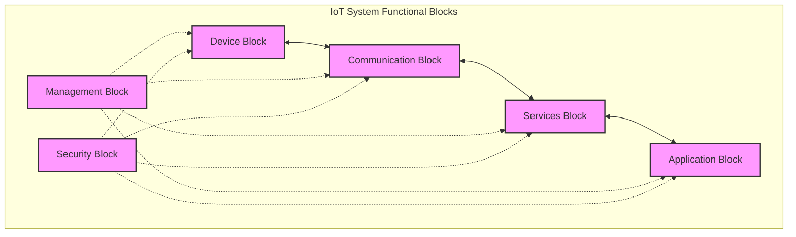
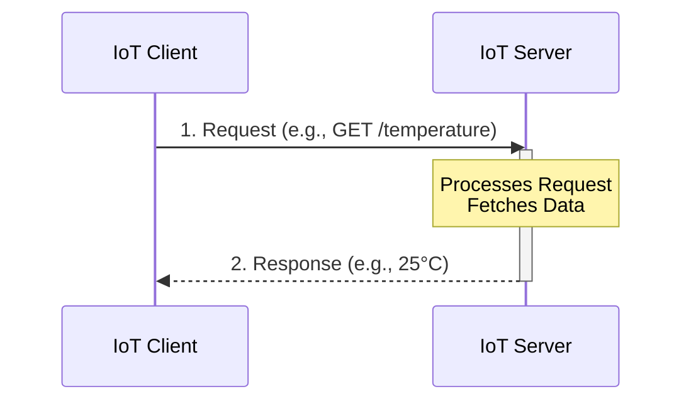
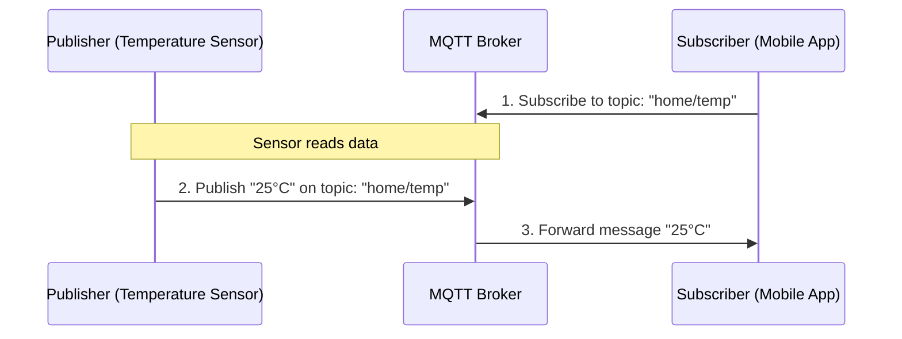
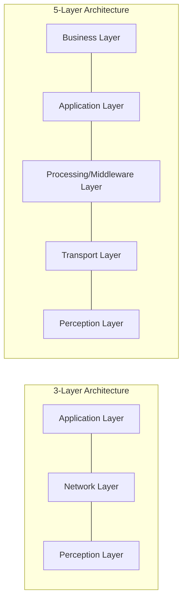
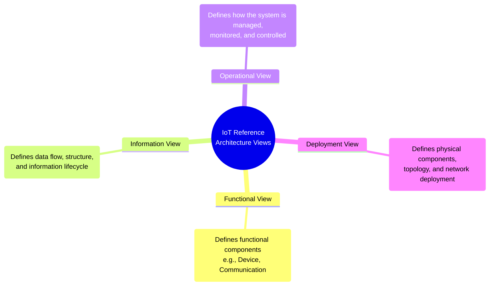

# IoT Exam Figures & Architectures

This document contains all the essential architectural diagrams and models for your IoT exam, specifically tailored to the syllabus and your module notes. These diagrams are written using `mermaid.js`, which renders natively on GitHub. Memorize these diagrams to score full marks (6M) in architecture and model-related questions!

---

## Part 1: Introduction to IoT

### 1. IoT Logical Design (Functional Blocks)
This diagram illustrates the logical functional blocks of an IoT system. Use this when asked about the **Logical Design of IoT** or **IoT Functional Blocks**.



---

### 2. IoT Communication Models
These are the most common ways IoT devices and servers communicate.

#### A. Request-Response Model (e.g., HTTP/REST)


#### B. Publish-Subscribe Model (e.g., MQTT)


---

### 3. Common IoT Layered Architectures
Use this when asked about the **Physical Architecture**, **Protocol Stack**, or **Layered Design**.



---

## Part 2: M2M to IoT - The Vision & Architecture Overview

### 4. M2M vs IoT Value Chain
A crucial distinction showing the shift from siloed (M2M) to ecosystem-driven (IoT) models.

```mermaid
graph TD
    subgraph M2M Value Chain (Linear & Siloed)
        M1[Hardware / Device] --> M2[Network Provider] --> M3[System Integrator] --> M4[Single Application]
    end

    subgraph IoT Value Chain (Networked & Data-Driven)
        I1[Smart Devices & Sensors] <--> I2[Connectivity / Network]
        I2 <--> I3[Cloud Platform / Data Analytics]
        I3 <--> I4[Smart Home App]
        I3 <--> I5[Smart Healthcare App]
        I3 <--> I6[Smart City App]
    end
    
    style M4 fill:#ffcccc,stroke:#333
    style I4 fill:#ccffcc,stroke:#333
    style I5 fill:#ccffcc,stroke:#333
    style I6 fill:#ccffcc,stroke:#333
```

---

## Part 3: IoT Reference Architecture

### 5. Architectural Views of IoT
When asked about the **Reference Architecture Views**, use this structure to explain how the architecture is divided into different functional perspectives.



---

## Part 4: IoT Enablers & Networking

### 6. Wireless Sensor Network (WSN) & IoT Gateway
Use this to explain **WSN Architecture** and the **Role of an IoT Gateway**.

```mermaid
graph TD
    subgraph Wireless Sensor Network (Edge)
        S1((Sensor Node 1)) --> Gateway[IoT Gateway]
        S2((Sensor Node 2)) --> Gateway
        S3((Sensor Node 3)) --> Gateway
        S4((Sensor Node 4)) --> Gateway
    end
    
    Gateway -- "Translates Protocols & Aggregates Data" --> Internet((Internet / WAN))
    Internet --> Cloud[Cloud Server / Database]
    Cloud --> App[User Dashboard / Analytics]
```

---

## Part 5: Domain-Specific Applications of IoT

### 7. Smart Home Automation Architecture
A standard example of a domain-specific IoT deployment.

```mermaid
graph TD
    subgraph Home Environment (Perception & Local Network)
        Light[Smart Light Bulb] -. "Zigbee" .-> Hub[Smart Home Hub]
        Thermo[Smart Thermostat] -. "Z-Wave" .-> Hub
        Lock[Smart Door Lock] -. "BLE" .-> Hub
    end
    
    Hub -- "Wi-Fi / Ethernet" --> Router[Home Internet Router]
    Router -- "Internet" --> Cloud[IoT Cloud Platform]
    
    subgraph Remote Application
        Cloud <--> Mobile[User's Mobile App]
    end
```

---
**Tips for the Exam:**
- Whenever a 6-mark question asks for "Architecture", "Design", or "Functional Blocks", **draw the corresponding block diagram first**.
- Label the protocols (like MQTT, HTTP, Zigbee, BLE) clearly on the arrows, as examiners look for these keywords.
- For "M2M vs IoT", always visually contrast the "Linear/Silo" approach with the "Ecosystem/Platform" approach.