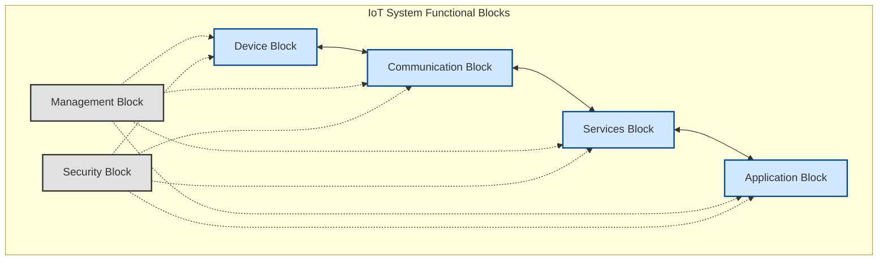
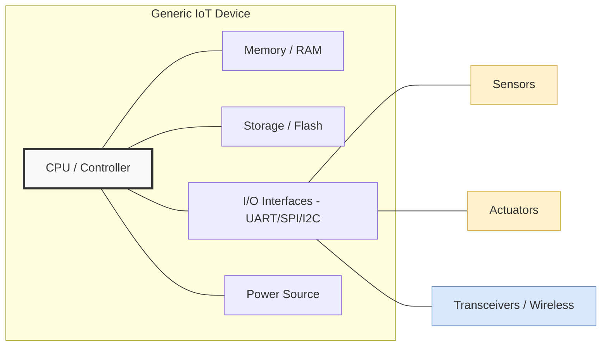
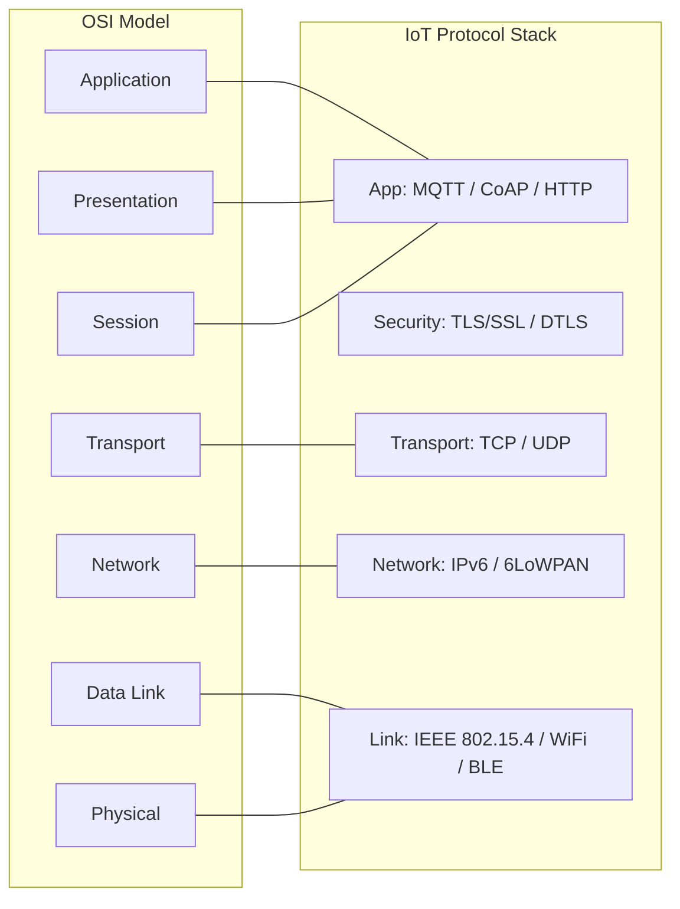
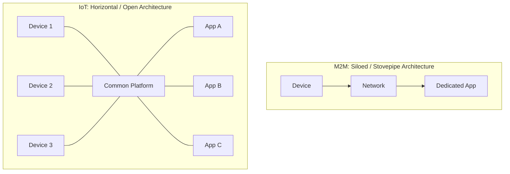
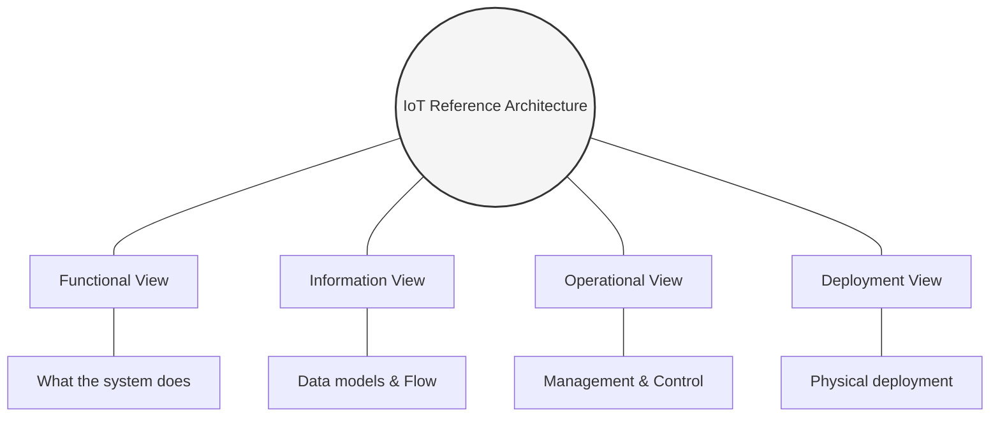
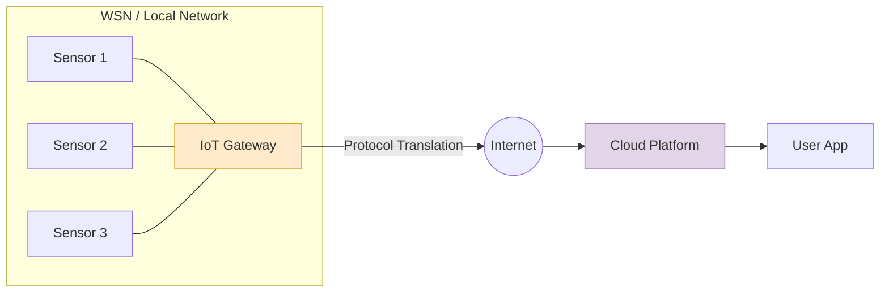
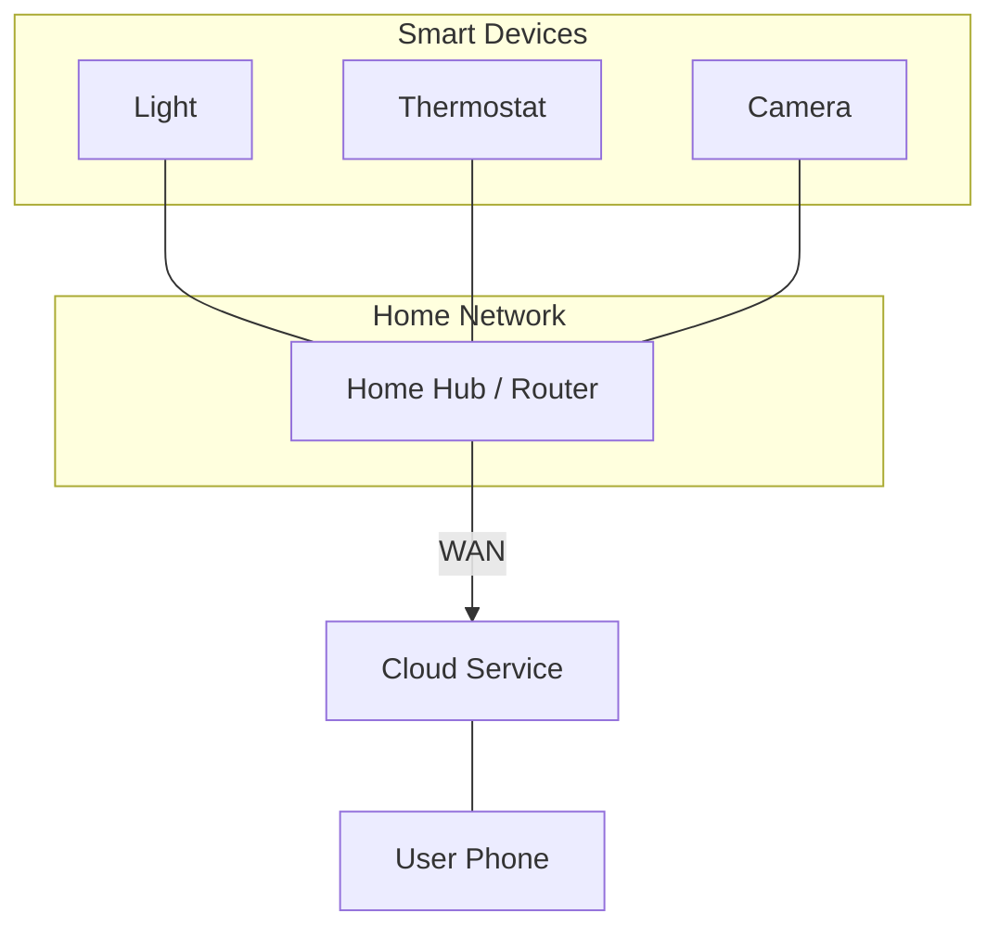

# IoT Exam Figures & Architectures (Comprehensive Version)

This document contains all the essential architectural diagrams and models for your IoT exam. These diagrams use a simplified `mermaid.js` syntax to ensure 100% rendering compatibility on GitHub and include professional styling.

---

## 1. IoT Logical Design (Functional Blocks)
Use this when asked about the **Functional Blocks of an IoT System**.
*Color theme: Professional Blue/Gray*

---

## 2. Physical Design: Generic IoT Device Block Diagram
Use this when asked about the **Physical Design** or **IoT Node Components**.

---

## 3. IoT Layered Architectures (Evolution)
Use this to compare the **3-Layer, 4-Layer, and 5-Layer models**.

```mermaid
graph TD
    subgraph Three_Layer[3-Layer Model]
        L3A[Application]
        L3N[Network]
        L3P[Perception]
        L3A --- L3N --- L3P
    end

    subgraph Four_Layer[4-Layer Model]
        L4A[Application]
        L4S[Service / Support]
        L4N[Network]
        L4P[Perception]
        L4A --- L4S --- L4N --- L4P
    end

    subgraph Five_Layer[5-Layer Model]
        L5B[Business]
        L5A[Application]
        L5M[Middleware / Processing]
        L5T[Transport]
        L5P[Perception]
        L5B --- L5A --- L5M --- L5T --- L5P
    end
```

---

## 4. IoT Protocol Stack vs. OSI Model
Essential for **"IoT Networking Basics"** or **"IoT Protocol Stack"** questions.

---

## 5. M2M vs. IoT: Architectural Shift
(Fixed rendering for GitHub)

---

## 6. IoT Reference Architecture: The 4 Views
Use this for **"Architectural Views of IoT"**.

---

## 7. WSN Architecture & IoT Gateway
(Fixed rendering for GitHub)

---

## 8. Domain Application: Smart Home
(Fixed rendering for GitHub)

---
**Cheat Sheet for Full Marks:**
1. **Always label layers:** Mention protocols like 6LoWPAN, MQTT, and 802.15.4.
2. **Horizontal vs Vertical:** For M2M to IoT questions, highlight that M2M is vertical (siloed) and IoT is horizontal (layered/open).
3. **Reference Model:** If asked for ITU-T, use the 4-layer model (Application, Service & Application Support, Network, Device).
