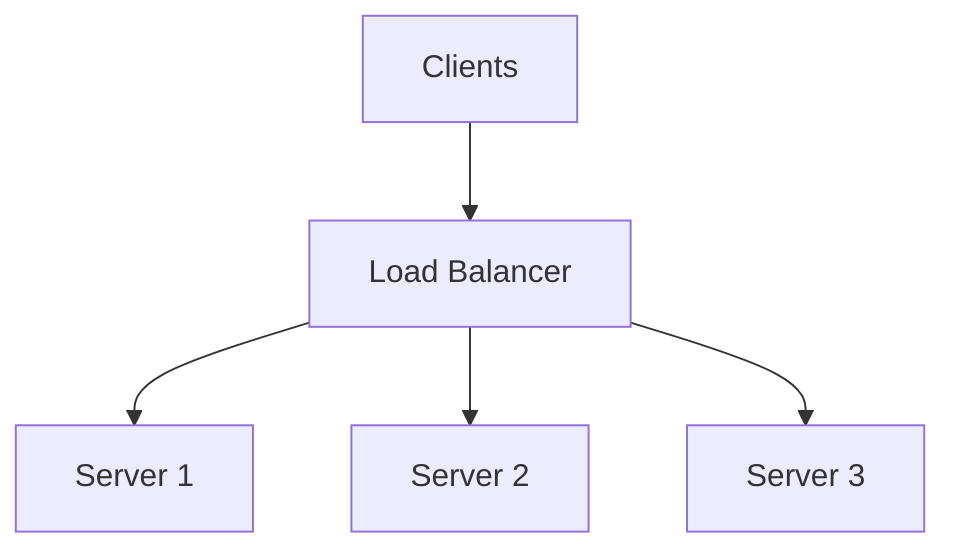
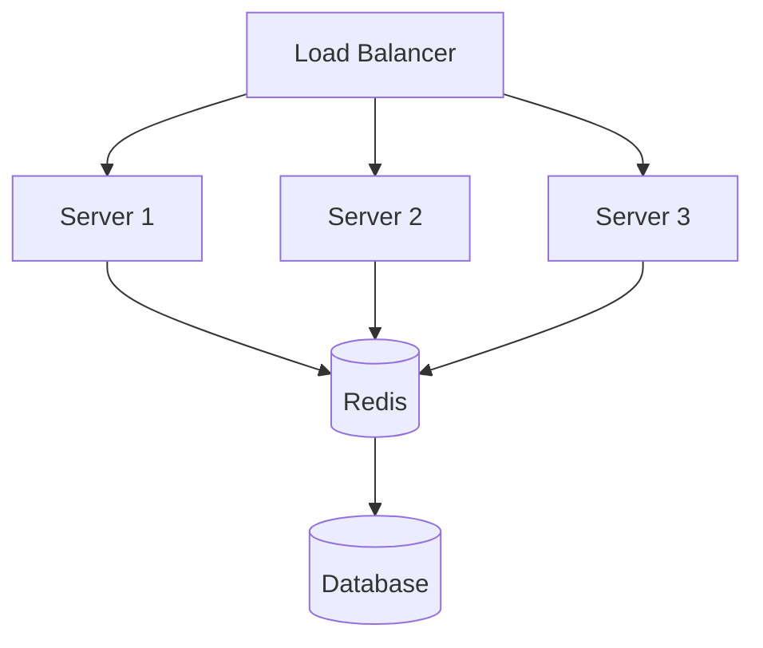

**SCALING ALGO:**

This file focuses on **load balancing algorithms**: how a load balancer decides which server should handle a request.

Core goal:
* Distribute load so no single server gets overloaded.
* Keep latency low and availability high.

Before algorithms, remember:
* A load balancer must also do **health checks** and stop sending traffic to unhealthy nodes.
* Algorithms behave differently for:
  * short requests vs long-lived connections (websocket/streaming)
  * identical servers vs mixed-capacity servers
  * stateless vs stateful systems

---

## Figure: Where Load Balancing Sits

---

**1-ROUND ROBIN->**
Rotates through servers in order to distribute requests evenly.

Example:
* Request 1 -> Server 1
* Request 2 -> Server 2
* Request 3 -> Server 3
* Request 4 -> Server 1

Pros:
* Simple to implement and reason about.
* Works fine when:
  * servers have identical capacity
  * requests are similar in cost

Cons:
* Doesn't consider:
  * server health (unless combined with health checks)
  * server load (CPU/memory)
  * request complexity (some requests are heavier than others)

When to use:
* Stateless APIs with uniform traffic patterns.

---

**2-LEAST CONNECTIONS->**
Sends the request to the server with the fewest active connections.

Example state:
* Server 1: 50 connections
* Server 2: 30 connections ← send here
* Server 3: 45 connections

Pros:
* Better when requests have variable duration (file uploads, streaming, long polling).
* Helps avoid sending new traffic to a server already "busy" with many open connections.

Cons / gotchas:
* Needs per-server connection tracking.
* "Fewest connections" isn't the same as "lowest CPU".
  * One connection might be extremely expensive.
* For HTTP/2, one TCP connection can multiplex many requests, which can distort "connection count" as a signal.

When to use:
* Long-lived connections or uneven connection lifetimes.

---

**3-IP HASH (Sticky Sessions)->**
Hashes the client IP and maps it to a server, so a user tends to hit the same server repeatedly.

Example:
* User IP: `192.168.1.100`
* Hash: `hash(ip) % 3 = 1`
* Always send to Server 1

Pros:
* Enables "stickiness" without server-side shared session store.
* Can reduce cache misses if server has local cache.

Cons (important):
* Not reliable identity:
  * many users may share an IP (NAT, mobile carriers)
  * user IP can change (mobile networks, VPN)
* If a server dies, the mapping changes and the user may lose in-memory session state.
* Can create uneven load if one IP range is more active.

When to use:
* Legacy systems where introducing a shared session store is not feasible (short-term solution).

Better alternatives:
* Sticky cookie based routing (LB sets a cookie like `lb_route=...`)
* Centralized session store (Redis)
* Stateless auth (JWT)

---

**4-WEIGHTED ROUND ROBIN->**
Assign weights to servers so higher-capacity servers get more traffic.

Example weights:
* Server 1 (16 cores): weight 4
* Server 2 (8 cores) : weight 2
* Server 3 (4 cores) : weight 1

Distribution:
* Server 1 gets 4/7 ~= 57%
* Server 2 gets 2/7 ~= 29%
* Server 3 gets 1/7 ~= 14%

Pros:
* Works well when servers are not identical (mixed instance types).
* Simple, deterministic distribution.

Cons:
* Weights are static unless you implement dynamic weight adjustments.
* Still not directly aware of real-time CPU or request cost.

When to use:
* Heterogeneous fleets, or during gradual migrations where some nodes are bigger.

---

## Additional Useful Algorithms (Common in Real Systems)

**5-LEAST RESPONSE TIME->**
Routes to the server with the lowest measured latency (often combined with active requests).

Pros:
* Adapts to hotspots and slow nodes.

Cons:
* Needs measurement windows; can be noisy.
* Can cause oscillations if not smoothed (everyone routes to "fastest", then it becomes slow).

**6-RANDOM / POWER OF TWO CHOICES->**
* Random: pick any server randomly.
* Power of two choices: pick two random servers, choose the less loaded one.

Why it's surprisingly good:
* Power-of-two is simple and often close to least-connections quality with much less tracking overhead.

**7-CONSISTENT HASHING (common for caches)->**
Hash a key (user_id, session_id, cache_key) to a node using a consistent hash ring.

Pros:
* When nodes are added/removed, only a fraction of keys move.
* Great for distributed caches (memcached/redis client-side sharding).

Cons:
* Needs careful handling of hot keys.
* Still needs health-aware re-routing.

---

## Health Checks (Non-Negotiable)
No algorithm matters if you send traffic to unhealthy servers.

Types:
* **Liveness**: "is the process up?" (fast, shallow)
* **Readiness**: "can it serve requests?" (checks dependencies, warmup, etc.)

Failure modes:
* If health checks are too aggressive -> flapping (servers repeatedly removed/added)
* If too slow -> you send traffic to dead nodes for too long

---

Part: Horizontal Scaling -> Pros & Cons (How Algorithms Fit In)

Pros of horizontal scaling:
1. No ceiling (you can add more nodes)
2. High availability (no single node failure brings you down)
3. More elasticity (autoscaling)
4. Cost efficiency at large scale (many small nodes can be cheaper than one huge node)

Cons of horizontal scaling (the real reasons it's hard):
1. Complexity (more moving parts):
   * load balancer
   * health checks
   * autoscaling policies
   * deployments across many nodes
   * observability (logs/metrics/traces)
2. State management nightmare:
   * sessions and in-memory caches don't automatically move between servers
3. Data consistency challenges:
   * multiple servers concurrently writing to shared DB

## Figure: Shared Session Store Fixes "State"

---

Q&A (Interview style)

**Q1: "Why doesn't everyone just use horizontal scaling?"**
Good answer:
* Horizontal scaling adds complexity cost:
  * load balancers, orchestration (Kubernetes), distributed sessions, monitoring
* Not every system scales horizontally easily (databases are the classic example).
* Sometimes you're bottlenecked elsewhere (DB, upstream dependency), so adding app servers doesn't help.

**Q2: "How do you handle sessions in horizontal scaling?"**
Good answer: 3 common approaches:
1. Sticky sessions (least recommended long-term)
2. Central session store (recommended for server-side sessions): Redis/Memcached
3. JWT tokens (stateless): validate signature each request

**Q3: "When should I use least-connections vs round-robin?"**
Good answer:
* Round robin: uniform, short requests, identical servers
* Least connections: variable duration/streaming, long-lived connections
