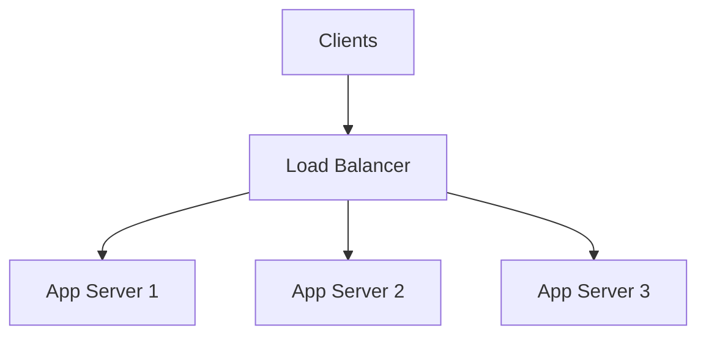
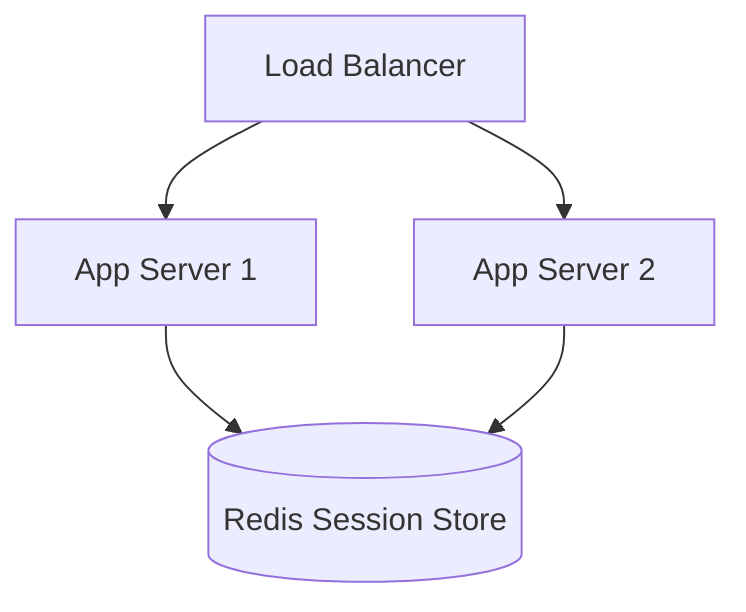

SCALING:

---

Scaling is how you keep a system working as traffic, data, and feature complexity grow.

There are two big questions in scaling:
1. **Capacity**: How much traffic can we handle?
2. **Reliability**: What happens when parts fail?

---

Part 1: Understanding Server Capacity (The Math)

Scenario: Your current setup
* CPU: 4 cores
* RAM: 16 GB
* Network: 1 Gbps

Question: How many users can this server handle?

### Metric 1: Requests Per Second (QPS - Queries Per Second)
Assumptions:
* Each user makes 10 requests per day (view list, add task, refresh, etc.)
* Users are active during a 12-hour window (9 AM - 9 PM) = 43,200 seconds

Math:
* Daily Active Users (DAU) = 100,000
* Requests per user per day = 10
* Total requests per day = 100,000 * 10 = 1,000,000 requests
* Average QPS = 1,000,000 / 43,200 ~= 23 QPS

Peak traffic matters:
* Peak can be 3-5x average (lunch hour, evening)
* Peak QPS ~= 23 * 5 ~= 115 QPS

### Metric 2: Latency (Time per request) controls throughput
If one request takes 10ms of CPU time, a single core can theoretically do ~100 req/s CPU time (ignoring overhead).

Rule of thumb:
* More latency per request -> fewer QPS a server can handle.

Example intuition (very simplified):
* If CPU time per request = 10ms and you have 4 cores, capacity might be ~400 QPS.
* If CPU time per request = 100ms, capacity might be ~40 QPS.
* If peak incoming is 115 QPS and you can only do 40 QPS, requests queue up and you time out.

### The key interview point: Bottleneck decides capacity
Capacity is limited by the tightest resource:
* CPU bound: heavy computation, JSON parsing, encryption, image processing
* IO bound: database calls, network calls, disk reads
* Memory bound: huge in-memory caches, large request/response objects, leaks
* Network bound: large responses, file downloads, images/videos

---

Part 2: The Two Ways to Scale

When one server isn't enough, you have two options:

```text
            How do I handle more traffic?
                       |
          +------------+------------+
          |                         |
     VERTICAL SCALING          HORIZONTAL SCALING
       (Scale Up)                (Scale Out)
```

### VERTICAL SCALING (Scale Up)
Increase the capacity of your existing server (bigger machine).

Before:
* Server: 4 CPU cores, 16 GB RAM
* Can handle: ~40 QPS (example)

After:
* Server: 32 CPU cores, 128 GB RAM, SSD
* Can handle: ~320 QPS (example)

Pros of vertical scaling:
* Simple: upgrade instance size
* No code changes: app doesn't know the difference
* Less distributed complexity: fewer moving parts
* Strong consistency is easier (single node patterns)

Cons of vertical scaling:
1. **Physical limits**: there is a ceiling.
2. **Single point of failure (SPOF)**: if it dies, you're down.
3. **Downtime / risk during upgrade**: often requires restart or migration.
4. **Cost inefficiency**: big instances often cost disproportionately more.
5. **Overkill for variable traffic**: you pay for peak even at off-peak.

### HORIZONTAL SCALING (Scale Out)
Add more servers.

Before:
* 1 server: 4 cores, 16 GB
* Capacity: ~40 QPS

After:
* 10 servers: each 4 cores, 16 GB
* Capacity: ~400 QPS (10 * 40)

Why you need a Load Balancer:
* If you have many servers, you need one public entry point that distributes requests.

## Figure: Basic Horizontal Scaling


Pros of horizontal scaling:
* Higher availability (no single server outage kills the system)
* Elastic scaling (autoscale up/down)
* Commodity hardware can be cost effective at scale

Cons of horizontal scaling:
* More complexity: LB, health checks, deployments, observability
* State management becomes hard (sessions, caches)
* Data consistency challenges for shared data stores

---

Part 3: The Load Balancer (Why It Exists)

What a load balancer does:
* Accepts traffic for `www.myapp.com`
* Chooses an upstream server based on a policy (round robin, least connections, etc.)
* Performs health checks to avoid sending traffic to dead/unhealthy servers
* Can terminate TLS (HTTPS), compress responses, enforce rate limits, etc. (depending on L7 vs L4)

### L4 vs L7 Load Balancing
* **L4 (Transport)**: routes TCP/UDP connections (fast, less aware of HTTP).
* **L7 (Application)**: routes based on HTTP path/host/headers (smarter, can do routing rules).

---

Part 4: The Hidden Enemy: Queues and Tail Latency

When utilization rises, latency grows non-linearly due to queueing.

What happens near 100% CPU:
* Requests don't fail immediately
* They queue up
* Response times explode
* Timeouts happen

Important interview concept:
* **Average latency is not enough**. You care about **p95/p99** (tail latency).

Example:
* p50 = 30ms (typical user)
* p99 = 900ms (worst 1% users, often what causes timeouts and bad UX)

---

Part 5: State Management (The Main Horizontal Scaling Problem)

Problem:
* User logs in -> request goes to Server 1
* Server 1 stores session in its memory
* Next request -> load balancer sends to Server 2
* Server 2 doesn't know the session -> user is "logged out"

Solutions:
1. **Sticky sessions** (quick fix, not ideal): LB routes the same user to the same server.
2. **Central session store** (recommended for server-side sessions): store sessions in Redis/Memcached/DB.
3. **Stateless auth** (JWT): server stores no session; client sends token each request.

## Figure: Centralized Session Store


---

Part 6: The Real-World Hybrid Strategy

Most companies use both vertical and horizontal scaling:
* App servers: scale horizontally (stateless design)
* Database: scale vertically first, then horizontally (replicas/sharding) as needed

## Figure: Hybrid Scaling Pattern
```mermaid
flowchart TB
  C[Clients] --> LB[Load Balancer]
  LB --> A1[App Server (large)]
  LB --> A2[App Server (large)]
  LB --> A3[App Server (large)]
  A1 --> DB[(Database: beefy primary)]
  A2 --> DB
  A3 --> DB
  DB --> R1[(Read replica)]
  DB --> R2[(Read replica)]
```

Why this pattern works:
* App tier is easier to replicate (stateless)
* DB tier is stateful, harder to distribute; you scale it carefully

---

Common Interview Questions (With "Good" Reasoning)

**Q1: Why doesn't everyone just use horizontal scaling?**
Good answer:
* Horizontal scaling increases availability and throughput, but adds major complexity:
  * load balancers, orchestration, deployments, distributed sessions, monitoring
* Some bottlenecks don't improve by adding app servers (e.g., DB bottleneck).
* For MVPs/small teams, it can be over-engineering.

**Q2: Your server is at 80% CPU. Do you scale vertically or horizontally?**
Good answer:
1. Diagnose first:
   * is it a code inefficiency? (optimize)
   * is it a slow DB query? (index/optimize)
   * is it a dependency latency spike? (timeouts/circuit breakers)
2. If it's real sustained traffic:
   * scale vertically for a quick short-term fix
   * scale horizontally for long-term growth + availability
3. After scaling:
   * re-check bottlenecks (DB might become the new bottleneck)

**Q3: What should you monitor while scaling?**
Good answer: monitor the whole request path:
* QPS, error rates, latency (p50/p95/p99)
* CPU/memory, GC, thread pools
* DB QPS, slow queries, connections, locks
* Cache hit rate
* Queue depths (if async)
