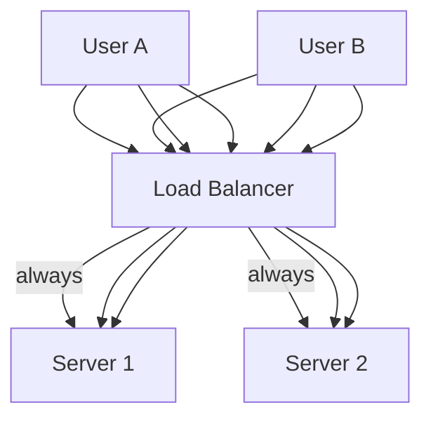
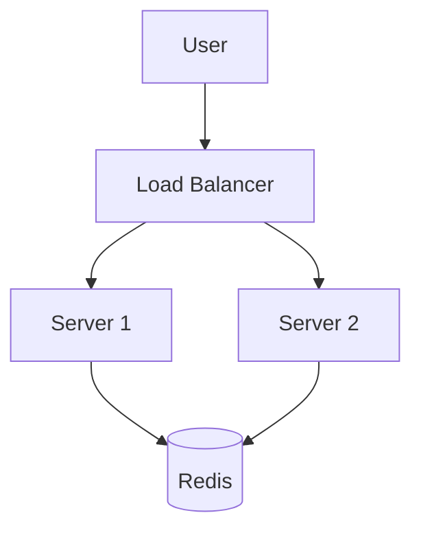
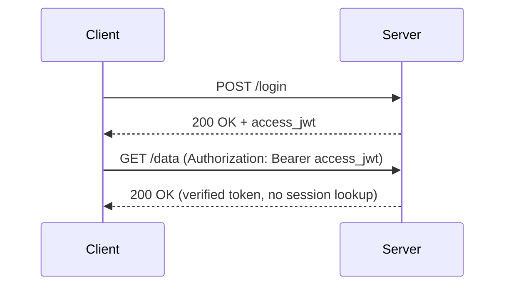

#### **STATE MANAGEMENT:**

**State->** Stored information about a user/session that persists across requests and lets the system behave consistently.

State management is how your system **stores, retrieves, and updates user-specific data** across multiple requests.

Examples of "state":
* Auth state: logged in / logged out
* Shopping cart contents
* User preferences (theme, language)
* Rate limiting counters
* Feature flags / experiments bucket
* Long-running workflows (checkout, uploads)

Important distinction:
* Some state is **business state** (orders, payments) and must be stored durably in a database.
* Some state is **session/UI state** (cart draft, logged-in marker) and may be stored in cookies/Redis.

---

### Why state becomes a "nightmare" with load balancing
Scenario:
* User logs in -> request goes to Server 1
* Server 1 stores session in its memory: `user = logged in`
* Next request -> load balancer sends it to Server 2

Problem:
* Server 2 has no idea who this user is

Result:
* User gets logged out
* Cart disappears
* App behaves inconsistently

## Figure: The Problem (In-Memory Sessions + Load Balancing)
```mermaid
flowchart TB
  U[User] --> LB[Load Balancer]
  LB --> S1[Server 1 (has session)]
  LB --> S2[Server 2 (no session)]
  U -->|Req 1| LB --> S1
  U -->|Req 2| LB --> S2
```

---

## Common Solutions

### 1. Sticky Sessions (quick fix, not ideal long-term)
Sticky sessions means the load balancer tries to route a given user to the same server.

How it's implemented:
* IP hash (not great)
* LB-issued cookie like `lb_route=server_2`

Pros:
* Minimal application changes
* Works for in-memory sessions

Cons:
* Uneven load (some servers get "hot" users)
* If a server dies -> users tied to it lose session
* Harder to autoscale cleanly

## Figure: Sticky Sessions


---

### 2. Centralized Session Storage (recommended for server-side sessions)
Store session state in a shared system like Redis/Memcached (or DB).

Now:
* Server 1 stores session in Redis
* Server 2 can read it too
* Any server can handle any request

Pros:
* Works great with horizontal scaling
* Users don't lose session if an app server restarts

Cons:
* Redis becomes a critical dependency (needs HA: replication/clustering)
* Adds network hop (slightly higher latency than in-memory)

## Figure: Shared Session Store


---

### 3. Stateless Approach (JWT)
Don't store session on server at all. Instead:
* Store identity + expiry in a signed token (JWT)
* Each request carries its own "auth state"

Pros:
* App servers are truly stateless (easy to scale)
* No centralized session lookup on every request

Cons:
* Harder to revoke immediately
* Token theft stays valid until expiry
* You still need a DB for business data (orders, carts, etc.)

## Figure: Stateless JWT


---

## Missing but Important: Not all state is "session state"
In system design, you usually separate state into tiers:

1. **Durable business state (DB)**
* Orders, payments, inventory, user profiles
* Must survive restarts and be strongly consistent where needed

2. **Derived/accelerated state (Cache)**
* Cache of user profile, product lists
* Can be rebuilt; consistency can be eventual

3. **Session state (Redis/cookies)**
* Login sessions, cart drafts, CSRF tokens
* Needs quick access and expiration policies

4. **Client state**
* UI state, local preferences, offline drafts

---

## Interview Rule of Thumb
* If state must be correct forever -> store it in the database.
* If state is for speed and can be rebuilt -> cache it.
* If state is per-user session and expires -> session store (Redis) or stateless JWT.
