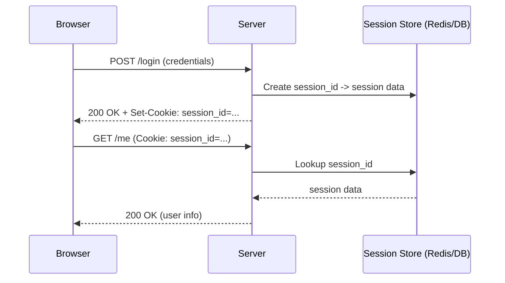
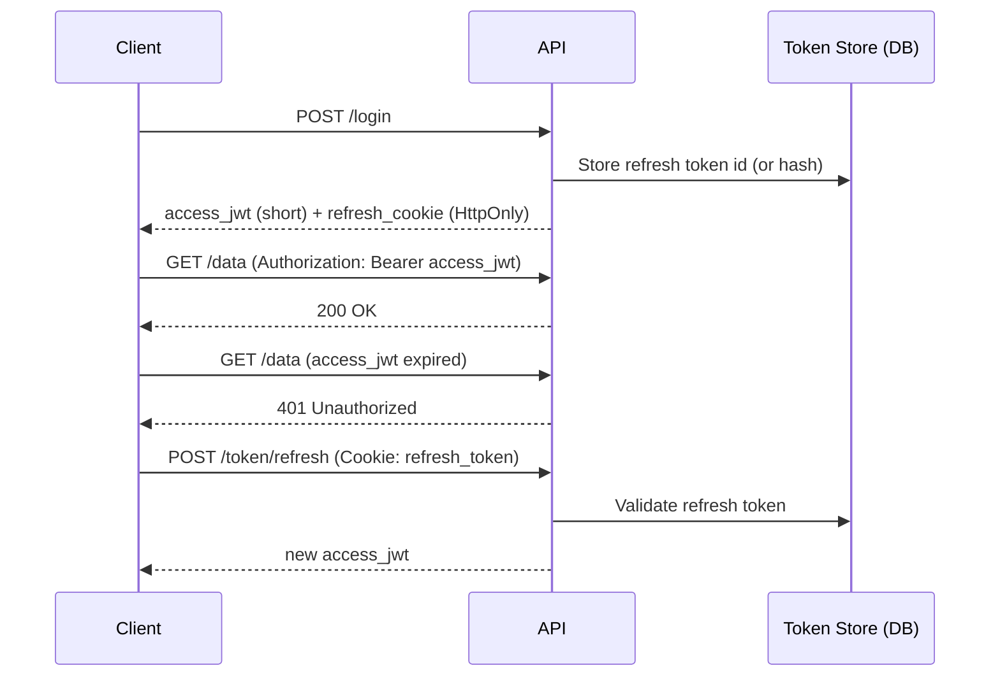

**Session->** A session is the server's way to "remember" a user across multiple HTTP requests.

* HTTP is stateless: the server does not automatically remember who you are between requests.
* A session usually works by issuing a **session id** (random string) and storing it in a cookie.
* The session id is a **key**. The actual user/session data is stored server-side (memory/DB/cache like Redis).

Typical flow:
1. You log in.
2. Server creates a random `session_id`.
3. Server stores session data keyed by that id (e.g., `session_id -> {user_id, roles, created_at, csrf_token}`).
4. Server sends `Set-Cookie: session_id=...` to the browser.
5. Browser sends `Cookie: session_id=...` on future requests.
6. Server looks up session id and authenticates the request.

## Figure: Classic Server-Side Session


---

**Good session IDs are:**
* Random (cryptographically strong randomness)
* Unique per session
* Hard to guess
* Long enough (avoid brute-force)

If someone steals your session id, they can impersonate you. That is **session hijacking**.

---

## Where Session Data Is Stored (Important for scaling)
Common options:
* **In-memory on the server**
  * Pros: fast, simple
  * Cons: breaks with horizontal scaling unless sticky sessions; lost on server restart
* **Centralized session store (Redis/Memcached)**
  * Pros: scalable across many app servers; session survives app server restarts
  * Cons: session store becomes a critical dependency; needs HA (replication, clustering)
* **Database**
  * Pros: durable, simpler operationally in some stacks
  * Cons: can be slower; needs careful indexing/cleanup; high write volume can be expensive

---

**Stateful->** The server keeps "memory" of the user across requests by storing state server-side.

How it works (stateful sessions):
* You log in
* Server creates a session
* Stores user/session data server-side
* Client stores only a session id (cookie)
* Each request: server looks up session id

Key traits:
* Server stores user data
* Easy to log out / revoke (delete the session server-side)
* Good central control (admin invalidation, forced logout)
* Harder to scale without shared store or stickiness

---

**Stateless->** The server does not store session state; each request carries proof of identity (usually a signed token).

How it works (JWT-based auth):
* Server gives you a JWT (signed)
* You store it (cookie or memory/localStorage, depending on design)
* Every request: you send the JWT
* Server verifies the signature and reads claims (no DB session lookup required for "who are you")

Key traits:
* No server-side session storage required for authentication
* Easier to horizontally scale the app tier
* Harder to revoke immediately (tokens remain valid until expiry)
* Token size matters (sent on every request)

Scaling problem summary:
* 1 server: stateful is easy.
* 100 servers: if sessions are in-memory, users get logged out randomly when routed to different servers.
* Solutions:
  * shared store (Redis)
  * or go stateless (JWT)

---

**Session_id vs JWT:**

**Session_id (server-side session)->**
Pros:
* Easy to invalidate (delete session)
* Small cookie size
* Central control (force logout, rotate, revoke)

Cons:
* Needs server storage
* Needs shared store or sticky sessions when scaling horizontally

**JWT (stateless approach)->**
JWT format:
* `header.payload.signature`

Example payload (claims):
```json
{
  "user_id": 42,
  "role": "admin",
  "iat": 1710000000,
  "exp": 1710003600
}
```

Flow:
* Login -> server creates JWT
* Sends it to client (cookie or other storage)
* Client sends it back on every request
* Server verifies signature (no DB lookup needed for identity)

Problems with JWT (the real tradeoffs):
* Hard to revoke immediately:
  * If stolen, it stays valid until `exp`
* Role/permission changes:
  * old tokens may still grant old permissions until they expire
* Token bloat:
  * don't put large user profiles into JWT payloads

That's why many real systems:
* Use **short-lived access JWTs** (minutes)
* Plus **refresh tokens** (longer-lived, stored securely)
* Or use server-side sessions when central revocation is needed

---

## Refresh Tokens (Missing piece that matters in practice)
Access token (short-lived):
* Used for normal API calls
* Expires quickly (reduces damage if stolen)

Refresh token (long-lived):
* Used only to obtain a new access token
* Typically stored in an `HttpOnly; Secure` cookie
* Usually validated against a DB record so it can be revoked

## Figure: Access + Refresh Token Flow


---

## Session Security (What can go wrong + mitigations)

### 1. Session Hijacking (attacker steals session id)
How it happens:
* network sniffing (if no HTTPS)
* XSS stealing non-HttpOnly tokens
* malware / compromised device

Mitigations:
* HTTPS everywhere
* `Secure; HttpOnly; SameSite=Lax/Strict` cookies
* Rotate session id after login
* Short session lifetimes + idle timeouts
* Detect anomalies (IP/UA change, impossible travel) carefully (avoid false positives)

### 2. Session Fixation (attacker sets/forces a known session id)
Attack idea:
* attacker gets victim to use a session id the attacker knows
* after victim logs in, that session id becomes authenticated

Mitigation:
* Always **regenerate session id after login** (session rotation)

### 3. CSRF (cookies automatically sent)
If auth is cookie-based, the browser may attach cookies to cross-site requests.

Mitigation:
* `SameSite=Lax/Strict`
* CSRF tokens for state-changing requests
* Re-auth or step-up auth for sensitive actions

---

Q&A (Common Interview Questions)

**Q1: "Should I store JWT tokens in cookies or localStorage?"**
* `localStorage`:
  * Pros: easy
  * Cons: vulnerable to XSS token theft
* Cookies (`HttpOnly`):
  * Pros: JS can't read token (better against token theft)
  * Cons: cookie auto-send means you must handle CSRF correctly

**Q2: "How do you log out users in a JWT system?"**
Good answer:
* You can't "delete" a stateless JWT already issued.
* Common strategies:
  * short-lived access tokens + revoke refresh token server-side
  * token blacklist (works but can reintroduce state + high memory)
  * rotate signing keys (broad impact)

**Q3: "When do you prefer sessions over JWT?"**
Good answer:
* Prefer sessions when:
  * you need immediate revocation (admin force logout)
  * you want minimal token surface area and simple authorization checks
  * you are already operating a fast shared store (Redis) and want central control
